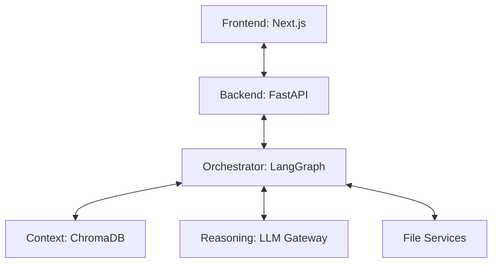
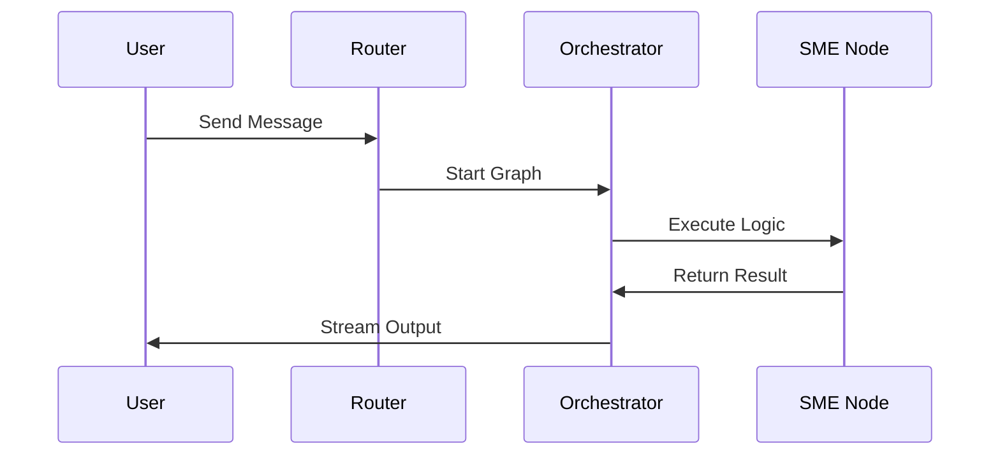

# SME-Forge Project (Enterprise Surgical Archive)

---

## 1. 📑 Executive Summary & Business Intent
- **Operational Purpose**: SME-Forge is a localized, agentic development environment designed to orchestrate complex software engineering tasks (discovery, generation, review, execution) via a multi-agent swarm. It bridges the gap between human engineering intent and automated code mutation.
- **Business Value & ROI**: drastially reduces architectural drift and technical debt by enforcing a structured workflow (Supervisor ➜ SME ➜ Reviewer) for every code change. Prevents IP leakage by prioritizing local LLM execution and vector storage.
- **Business Criticality**: **Tier 1 (Mission Critical)**. As a primary development interface, any failure in the orchestration or RAG layers directly halts the agentic development pipeline.
- **Stakeholder Registry**: Principal Engineers (Architectural governance), Developers (Core users), Security Architects (IP protection oversight).

---

## 2. 🏗️ System Architecture & Alignment
- **Architectural Paradigm**: Micro-Agentic Layered Architecture (De-coupled Frontend/Backend).
- **Technology Stack**: Python 3.11+ (FastAPI, LangGraph), Next.js (React), ChromaDB (Vector Persistence).
- **Deployment Topology**: Local standalone server/desktop execution; container-ready via standardized environmentals.

---

## 🔗 3. Integration Context & Interfaces
- **External Dependencies**: OpenAI/Azure LLM APIs, Local Transformers (Reranking), npm/node (UI), Git (VCS service).
- **Interface Contracts**: RESTful API v1 (FastAPI) for all agentic control; WebSocket-ready for streaming responses.
- **Data Flow Topology**: User Intent (Chat) ➜ API Route ➜ Agentic Orchestrator ➜ Context RAG Engine ➜ LLM Reasoning ➜ Filesystem Mutation ➜ UI Walkthrough.

---

## 📂 4. Structural Codebase Taxonomy
- **Component Geometry**: Root-level project containing `backend/`, `frontend/`, and `docs/`.
- **Key Artifacts**: `start_sme_forge.py` (Launcher), `backend/app/main.py` (Service Orchestrator), `backend/app/agents/orchestrator.py` (Reasoning Hub).

---

## 🧠 5. Functional Decomposition (Logical Mapping)
| Capability | Clinical / Business Intent | Implementation Logic | Code Origin | Outcomes |
| :--- | :--- | :--- | :--- | :--- |
| Agent Orchestration | Manage multi-agent handoffs | `orchestrator.py` / `LangGraph` | `backend/app/agents/` | Structured Workflow |
| Contextual Grounding | RAG-based code retrieval | `rag/` + `BM25` + `VectorStore` | `backend/app/rag/` | Precise Context Injection |
| Local Model Support | Offline AI asset management | `setup_models.py` | `backend/` | Privacy/Offline Readiness |
| Visual Coordination | Real-time state visualization | `frontend/` components | `frontend/src/` | Observability & Control |

---

## 🔄 6. Execution Flow (Block-by-Block Trace)
- **Primary Execution Path**:
  1. **Bootstrap**: `start_sme_forge.py` kills zombies ➜ Spawns Backend/Frontend.
  2. **Ingress**: User submits chat payload via `ChatPanel.tsx`.
  3. **Cognition**: Orchestrator triggers `discovery_node` ➜ `sme_node` ➜ `reviewer_node`.
  4. **Mutation**: `sme_executor` calls `file_service` to apply git-stashed diffs.
- **Logical Branching Matrix (Systemic)**:
  | Branch Trigger | Condition Syntax | Logic Action | Outcome |
  | :--- | :--- | :--- | :--- |
  | Authentication | `if auth_enabled` | Redirect to `Login.tsx` | Secure Access |
  | Context Quality | `if rerank_score < 0.5` | Filter RAG results | Accurate Context |

---

## 📞 7. Call Graph & Dependency Chain (Module Interconnects)
- **Structural Topology**: `Frontend` ➜ `API` ➜ `Orchestrator` ➜ (`Agents`, `RAG`, `Services`).
- **Dependencies**: The `Agents` module is heavily dependent on the `Services` tier for I/O and the `RAG` tier for grounding.

---

## 🗄️ 8. Data Architecture & Persistence DNA (State)
- **Storage Modalities**: ChromaDB (Vector), Local Filesystem (Source Code), In-memory (Agent graph state).
- **Data Persistence Strategy**: SQL-Lite via `Middleware/DB.py` for audit sessions; ChromaDB for document embeddings.

---

## ⚙️ 10. Environment & Configuration Matrix
- **Runtime Toggles**: `BACKEND_PORT`, `OPENAI_API_KEY`, `SME_LIBRARY_PATH`.
- **System Provisioning**: Requires ~8GB RAM for local embedding/reranking; CPU/GPU for LLM inference.

---

## 🚨 12. Fault Tolerance & Operational Resilience
- **Error Handling Matrix**:
  | Error Code / Type | Handling Pattern | Logic Gate | Recovery Action |
  | :--- | :--- | :--- | :--- |
  | LLM Timeout | Exponential Backoff | `gateway.py` | Retry or Fallback model |
  | Port Collision | netstat cleaning | `start_sme_forge.py` | Automatic PID termination |

---

## 🔐 13. Security, Risk & Compliance Model
- **IP Protection**: Local RAG ensures proprietary code never leaves the perimeter unless explicitly requested.
- **Input Sanitization**: API routes enforce validation on all agentic prompts.

---

## ⚡ 14. Performance & Telemetry Characteristics
- **Key Metrics**: LLM Time-to-First-Token (TTFT), RAG Indexing latency, and Chat history pruning efficiency.

---

## 🧪 15. Quality Assurance & Validation Logic
- **Pre-Conditions**: Verifiable `API_KEY` present; local `embedding_models` downloaded.
- **Testing Ledger**: Integrated `backend/tests/` module for route/agent validation.

---

## 🧯 16. Technical Debt & Risk Assessment
| Debt Category | Logic Block | Systemic Impact | Recommended Fix |
| :--- | :--- | :--- | :--- |
| Coupling | Backend/Frontend tight link | Limits independent scaling | Event-driven event bus |
| State | Graph state persistence | Lost history on restart | Persistent Graph State DB |

---

## 🧩 19. Procedural Summary (Surgical Deconstruction)
- **Systemic Workflow Ledger**:
  | Workflow Segment | Logic Breakdown (Strategic) | Inputs | Return / Side Effects |
  | :--- | :--- | :--- | :--- |
  | Ingress Logic | Synchronizes HTTP request with LLM session. | `ChatRequest` | Streamed JSON events |
  | RAG Loop | Multi-stage search (BM25 + Semantic + Rerank). | `Query` | Top-K context chunks |
  | Agent Synthesis | Supervisors route tasks to specific SMEs. | `Task` | Atomic code mutation |

---

## 🧬 20. Architectural Justification (Reverse Engineered)
- **Pattern: Local-First Agentic Loops**. SME-Forge assumes that the developer is the highest authority. The "Supervisor" node always defers to the "Reviewer" and the User via the "Human-in-the-loop" gating pattern.

---

## 🚀 21. Modernization & Migration Roadmap
- **Roadmap**: Transition to a fully distributed agentic architecture (using Redis for state) to support multi-user SME-Forge clusters.

---

## 📊 Visual Engineering (Mermaid)
### A. Component Infrastructure Topology

### B. Functional Execution Call Trace

