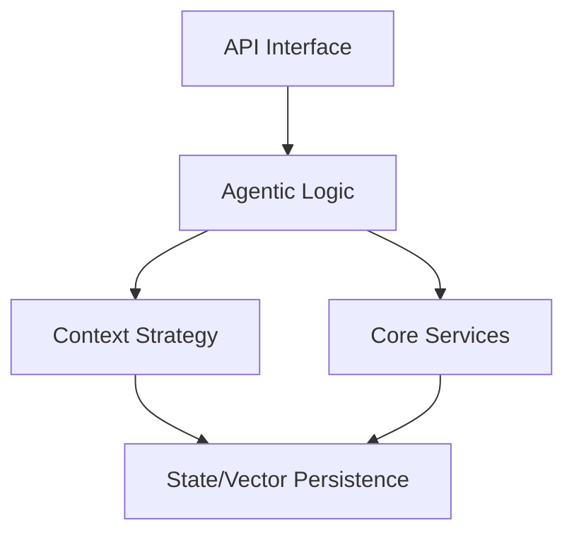
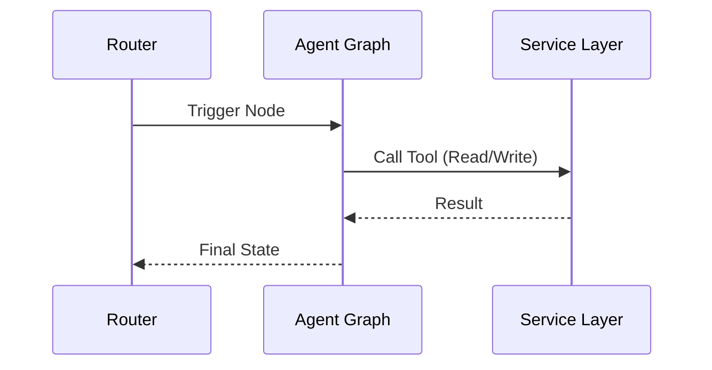

# backend Module (Enterprise Surgical Archive)

---

## 1. 📑 Executive Summary & Business Intent
- **Operational Purpose**: The `backend` module serves as the primary "Engine Room" for SME-Forge. It orchestrates all agentic reasoning, RAG (Retrieval Augmented Generation) indexing, and LLM gateway interactions, providing the functional logic required for code discovery and mutation.
- **Business Value & ROI**: Automates the technical heavy lifting of code analysis and generation, enabling developers to perform high-fidelity engineering tasks through simple natural language intent.
- **Business Criticality**: **Tier 1 (Mission Critical)**. The backend contains the core reasoning loops; a failure here renders the entire agentic ecosystem non-functional.
- **Stakeholder Registry**: Backend Engineers (Core logic), AI/ML Engineers (RAG/LLM optimization), Security (Auth/Audit oversight).

---

## 2. 🏗️ System Architecture & Alignment
- **Architectural Paradigm**: Layered Service Architecture with Agentic Graph Orchestration (FastAPI + LangGraph).
- **Technology Stack**: Python (3.11), FastAPI (HTTP Tier), LangChain (Agentic abstraction), ChromaDB (Persistence).
- **Deployment Topology**: Service-ready for local or containerized execution; relies on Pydantic-based settings for environment-driven configuration.

---

## 🔗 3. Integration Context & Interfaces
- **External Dependencies**: OpenAI (Cognition), Vector Store (Knowledge), Filesystem (Action Surface).
- **Interface Contracts**: 
  - **Ingress**: RESTful endpoints (`/api/v1/*`).
  - **Egress**: Git-stashed file modifications and streamed telemetry logs.
- **Data Flow Topology**: HTTP Request ➜ Router ➜ Agent Orchestrator ➜ Service/RAG Tier ➜ Git Service ➜ Response.

---

## 📂 4. Structural Codebase Taxonomy
- **Component Geometry**: `backend/app/` (Application Logic), `backend/scripts/` (Maintenance), `backend/tests/` (Validation).
- **Key Artifacts**: 
  - `app/main.py`: Service Hub.
  - `app/agents/`: Discovery/Reasoning Logic.
  - `app/rag/`: Context Retrieval Logic.
  - `app/services/`: Systemic Utility Logic.

---

## 🧠 5. Functional Decomposition (Logical Mapping)
| Capability | Clinical / Business Intent | Implementation Logic | Code Origin | Outcomes |
| :--- | :--- | :--- | :--- | :--- |
| API Orchestration | Unified service interface | `FastAPI Router` | `app/api/` | Standardized Access |
| Knowledge retrieval | High-context grounding | `Vector Store + BM25` | `app/rag/` | Accurate Code Context |
| Agent Execution | Multi-step reasoning | `LangGraph` Orchestration | `app/agents/` | Atomic Task Completion |
| File Management | Secure code mutation | `FileService + GitService` | `app/services/` | Controlled State Change |

---

## 🔄 6. Execution Flow (Block-by-Block Trace)
- **Primary Execution Path**:
  1. **Routing**: API receives a request (e.g., `/api/v1/chat`).
  2. **Initialization**: The `lifespan` hook initializes LLM and RAG gateways.
  3. **Context Injection**: RAG queries provide codebase context to the agentic graph.
  4. **Processing**: Supervisor agent delegates to specified SME agents.
  5. **Completion**: Final state is serialized and returned to the client.
- **Logical Branching Matrix (Backend-wide)**:
  | Branch Trigger | Condition Syntax | Logic Action | Outcome |
  | :--- | :--- | :--- | :--- |
  | RAG Miss | `if results == []` | Fallback to broad repository scan | Knowledge persistence |
  | Auth failure | `if verify_token == False` | Raise 401 Unauthorized | Secure boundaries |

---

## 📞 7. Call Graph & Dependency Chain (Module Interconnects)
- **Structural Topology**: `api` modules call `agents` for reasoning; `agents` call `rag` for data and `services` for action.
- **Inheritance**: Extensive use of Base/Abstract classes in the `agents` and `models` packages to ensure contract compliance.

---

## 🗄️ 8. Data Architecture & Persistence DNA (State)
- **Storage Modalities**: Local vector files (`~/.sme_forge/vector_store`), SQL-Lite for session audits, and temporary git stashes for code diffs.
- **Data Persistence Strategy**: Persistent storage of agent execution logs via the `AuditService`.

---

## ⚙️ 10. Environment & Configuration Matrix
- **Runtime Toggles**: `DEBUG`, `CORS_ORIGINS`, `DATABASE_URL`.
- **System Provisioning**: Uses `Pydantic-Settings` to enforce strict validation of configuration on startup.

---

## 🚨 12. Fault Tolerance & Operational Resilience
- **Error Handling Matrix**:
  | Error Code / Type | Handling Pattern | Logic Gate | Recovery Action |
  | :--- | :--- | :--- | :--- |
  | ChromaDB Error | Exception Catch | `rag/indexer.py` | Graceful fallback to SQL/File search |
  | LLM Rate Limit | Retrying logic | `llm/gateway.py` | Pause/Retry or model switch |

---

## 🔐 13. Security, Risk & Compliance Model
- **Compliance**: Adheres to a "Local-First" data residency principal.
- **Risk Mitigation**: All filesystem mutations are performed via a git-stage-first strategy to allow developer reversal (undo) of any agentic change.

---

## ⚡ 14. Performance & Telemetry Characteristics
- **Resource Intensity**: RAG indexing creates temporary CPU spikes; inference involves steady I/O wait-times.

---

## 🧪 15. Quality Assurance & Validation Logic
- **Testing Ledger**: Unit tests for routing and integration tests for agent graph traversal are located in `tests/`.

---

## 🧯 16. Technical Debt & Risk Assessment
| Debt Category | Logic Block | Systemic Impact | Recommended Fix |
| :--- | :--- | :--- | :--- |
| Coupling | DB/API dependencies | Module initialization order | Use Dependency Injection via FastAPI |

---

## 🧩 19. Procedural Summary (Surgical Deconstruction)
- **Top-Level Methodology Ledger**:
  | Method Scope | Logic Breakdown (Surgical) | Inputs | Return / Side Effects |
  | :--- | :--- | :--- | :--- |
  | `app.main.lifespan` | Orchestrates cold-start of AI gateways. | `FastAPI` context | Visual readiness logs |
  | `rag_indexer.initialize` | Warms up vector store connections. | Environmentals | Validated Search index |

---

## 🧬 20. Architectural Justification (Reverse Engineered)
- **Pattern: Service/Agent Segregation**. The backend intentionally separates "Services" (deterministic logic like file writing) from "Agents" (stochastic reasoning), ensuring that the agentic swarm has clearly defined tools.

---

## 📊 Visual Engineering (Mermaid)
### A. Module Interaction Graph

### B. Functional Execution Call Trace (Internal)

