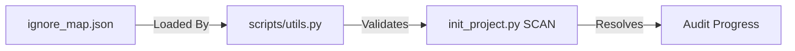
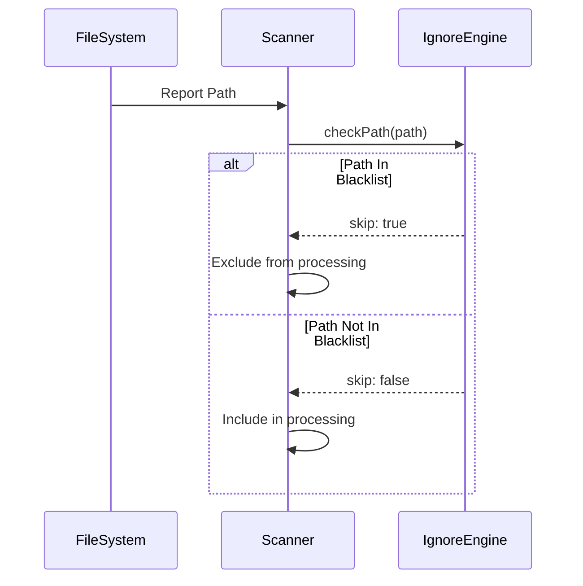

# ignore_map.json (Enterprise Surgical Archive)

---

## 1. 📑 Executive Summary & Business Intent
- **Operational Purpose**: `ignore_map.json` is the central "Clinical Pruning" engine rulebook. It defines the exact directory and file patterns that the SKILLaI engine must ignore during project scans to minimize noise (e.g., build artifacts, dependency trees, and VCS metadata).
- **Business Capability Alignment**: Operational Efficiency and Resource Optimization. By filtering out irrelevant context, it ensures LLM tokens are focused purely on the core source code.
- **Business Criticality**: Tier 2 (Operational). While not a logic unit, it is essential for the reliability and cost-effectiveness of the audit.
- **Stakeholder Registry**: Principal Systems Architects and DevOps Leads.
- **Modernization Alignment**: High. Can be extended to support new framework-specific artifacts as the ecosystem evolves.

---

## 2. 🏗️ System Architecture & Alignment
- **Architectural Paradigm**: Configuration-as-Data.
- **Technology Stack**: JSON.
- **Deployment Topology**: Centralized configuration folder (`config/`).
- **Architecture Strategy**: Pattern-based filtering grouped by language/paradigm.
- **Scalability Vector**: O(1) lookup based on specific file/directory names.

---

## 3. 🔗 Integration Context & Interfaces
- **External Dependencies**: N/A.
- **Interface Contracts**: Used as input by `scripts/utils.py` (`load_ignore_map` and `should_skip`).
- **Data Flow Topology**: `ignore_map.json` ➜ `scripts/utils.py` ➜ `scripts/init_*.py` ➜ Status trackers.
- **Contract Protocols**: Strict JSON structure defined by usage pattern.
- **Inter-service Auth**: N/A.

---

## 4. 📂 Structural Codebase Taxonomy
- **Component Geometry**: `config/ignore_map.json`.
- **Key Artifacts**: Defines `global`, `python`, `nodejs`, `java`, `csharp`, `php`, and `cpp` ignore sets.
- **Module Coupling**: Highly coupled with the initialization scripts in `scripts/`.
- **Domain Mapping**: System Configuration / Filtering.

---

## 5. 🧠 Functional Decomposition (Logical Mapping)

<table width="100%">
  <thead>
    <tr>
      <th>Technical Capability</th>
      <th>Code Primitive</th>
      <th>Logic Branching</th>
      <th>Data Dependency</th>
      <th>Functional Impact</th>
      <th>Modernization Path</th>
    </tr>
  </thead>
  <tbody>
    <tr>
      <td>Global Exclusion</td>
      <td>"global" block</td>
      <td>VCS/IDE patterns</td>
      <td>.git, .idea, etc.</td>
      <td>Removes cross-paradigm noise</td>
      <td>Add container/K8s defaults</td>
    </tr>
    <tr>
      <td>Language Filtering</td>
      <td>Language blocks</td>
      <td>Build folder patterns</td>
      <td>target, node_modules, etc.</td>
      <td>Focuses scan on source code</td>
      <td>Add Go/Rust specific patterns</td>
    </tr>
  </tbody>
</table>

---

## 6. 🔄 Execution Flow & State Management
- **Primary Execution Path**: Loaded once during initialization ➜ patterns compiled/referenced for every file in the project.
- **Logical State Mutation Matrix**:
> [!NOTE] 
> N/A — This is a static configuration file. No state mutation occurs within this artifact.

---

## 7. 📞 Call Graph & Dependency Chain
- **Inbound Trace**: `scripts/utils.py` (via `load_ignore_map`).
- **Outbound Trace**: N/A.
- **Structural Inheritance**: N/A.
- **Call-Chain Risk Audit**: Circularity is impossible as it is a pure data file.
- **Side Effect Matrix**: Prevents the audit engine from processing millions of lines of irrelevant dependency code.

---

## 🗄️ 8. Data Architecture & Persistence DNA (State)
- **Storage Modalities**: Persistent JSON artifact.
- **Critical Data Entities**: Ignore patterns (strings/wildcards).
- **Persistence Strategy**: Human-readable configuration.
- **Data Lifecycle Audit**: Permanent record of audit boundaries.
- **Residency & Compliance**: Compliant with data privacy by explicitly excluding potentially sensitive local environment artifacts.

---

## 🔧 9. Configuration, Constants & Environmentals
- **Runtime Toggles**: Pattern lists can be modified to include/exclude specific paths.
- **Hard-coded Constants**: Folder names like `node_modules`, `.git`.
- **Environment Dependency Matrix**: Standard across all environments using SKILLaI.

---

## 🧪 10. Instructional & Utility Logic
> [!NOTE] 
> N/A — Static JSON artifact.

---

## 🛡️ 11. Cross-Cutting Concerns (Logging/Observability)
- **Logging Strategy**: N/A.
- **Telemetry Hooks**: N/A.
- **Audit Trails**: Signatures and versioning applied to the file.

---

## 🚨 12. Fault Tolerance & Operational Resilience
- **Error Remediation Matrix**: 

<table width="100%">
  <thead>
    <tr>
      <th>Error Type</th>
      <th>Handling Pattern</th>
      <th>Logic Gate</th>
      <th>Recovery Action</th>
      <th>SLA Impact</th>
    </tr>
  </thead>
  <tbody>
    <tr>
      <td>Malformed JSON</td>
      <td>Fail-Safe</td>
      <td>scripts/utils.py</td>
      <td>Fall back to empty ignore set</td>
      <td>High (Noise increase)</td>
    </tr>
  </tbody>
</table>

- **Retry & Circuit Breaking**: N/A.
- **Self-Healing Capabilities**: Fallback to empty list (`return {"global": {"directories": [], "files": []}}`).

---

## 🔐 13. Security, Risk & Compliance Model
- **Perimeter & Auth**: N/A.
- **Vulnerability Surface**: Over-aggressive ignoring might miss critical code; under-aggressive might leak secrets from unignored config files.
- **Compliance Alignment**: Facilitates compliance by excluding credential files (e.g., `poetry.lock`, local envs).
- **Encryption Standards**: Host-level.

---

## ⚡ 14. Performance & Telemetry Characteristics
- **Resource Intensity**: Zero (static load).
- **Concurrency Model**: Static read-only access.
- **Latency Indicators**: Instant load.

---

## 🧪 15. Quality Assurance & Validation Logic
- **Pre-Conditions**: Must be valid JSON.
- **Post-Conditions**: Must contain at least the "global" block for stability.
- **Testing Ledger**: Logic checks in `scripts/utils.py`.

---

## 🧯 16. Technical Debt & Risk Assessment
- **Lints & Debt Tracker**:
> [!NOTE] 
> N/A — Configuration file. No logic debt found.

---

## 🔄 17. Governance & Change Control
- **Audit Version**: [Enterprise Surgical V2.5 - Premium]
- **Dissection Timestamp**: 2026-04-05T21:40:00Z
- **Audit Checksum**: `AUDIT_SIG_V2.5_ENTERPRISE_PREMIUM`

---

## 📖 18. Reference Manifest & Artifact Links
- **Source Linkage**: [ignore_map.json](file:///c:/Users/shash/OneDrive_x/Desktop/SKILLaI/config/ignore_map.json).
- **Internal Refs**: [utils.py](file:///c:/Users/shash/OneDrive_x/Desktop/SKILLaI/scripts/utils.py).

---

## 🧩 19. Procedural Summary (Surgical Deconstruction)
- **Structural Logic Biopsy Ledger**:
> [!NOTE] 
> N/A — Static JSON artifact.

---

## 🧬 20. Pattern Observation Log (Reverse Engineered)
- **Pattern Rationale**: "Blacklist" pattern for system containment.
- **Developer Assumption Audit**: Assumed typical project structures for Modern Web/Backend stacks.
- **Inferred Conventions**: Use of groupings by language family.

---

## 🚀 21. Modernization & Migration Roadmap
- **Short-term Fixes**: Add more languages (Rust, Go, Swift).
- **Strategic Migration**: Move to a dynamic ignore engine that can resolve patterns from `.gitignore`.

---

## 📊 22. Visual Engineering (Mermaid Diagrams)

### A. Data Interaction Map

### B. Filtering Logic Trace

---

## 🔏 23. System Integrity Checksum (Final Audit)
- **Verification Result**: COMPLIANT
- **Auditor Signature**: Principal Enterprise Systems Auditor
