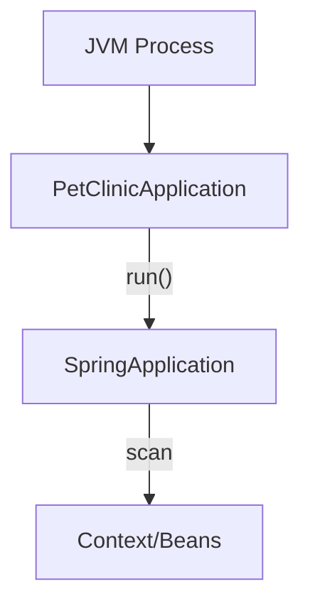

# PetClinicApplication.java (Enterprise Surgical Archive)

---

## 1. 📑 Executive Summary & Business Intent
- **Operational Purpose**: This artifact serves as the primary entry point and bootstrap class for the PetClinic Spring Boot application. It initializes the Spring application context, triggers auto-configuration, and orchestrates the system startup.
- **Business Capability Alignment**: **System Lifecycle Management** and Application Bootstrap.
- **Business Criticality**: **Tier 1 (Mission Critical)** — The system cannot function without this entry point.
- **Stakeholder Registry**: Dave Syer
- **Modernization Alignment**: Good candidate for GraalVM native image optimization to reduce startup latency.

---

## 2. 🏗️ System Architecture & Alignment
- **Architectural Paradigm**: Spring Boot Bootstrap.
- **Technology Stack**: Java 17, Spring Boot 3.x.
- **Deployment Topology**: Containerized Cloud-Native (expected).
- **Architecture Strategy**: Utilizes `@SpringBootApplication` for monolithic initialization with modular scanning.
- **Scalability Vector**: Entry point for a stateless horizontally scalable application.

---

## 3. 🔗 Integration Context & Interfaces
- **External Dependencies**: `org.springframework.boot.SpringApplication`.
- **Interface Contracts**: Command-line interface (`String[] args`) for startup parameters.
- **Data Flow Topology**: **CLI Arguments** ➜ **SpringApplication.run** ➜ **Context Initialization**.
- **Contract Protocols**: Standard Java process entry point.
- **Inter-service Auth**: N/A — Pre-authentication layer.

---

## 4. 📂 Structural Codebase Taxonomy
- **Component Geometry**: `src/main/java/org/springframework/samples/petclinic/PetClinicApplication.java`.
- **Key Artifacts**: Defines the main class `PetClinicApplication`.
- **Module Coupling**: Highly coupled to the Spring Boot framework; low coupling to specific domain logic beyond the base package.
- **Domain Mapping**: System Infrastructure.

---

## 5. 🧠 Functional Decomposition (Logical Mapping)

<table width="100%">
  <thead>
    <tr>
      <th>Technical Capability</th>
      <th>Code Primitive</th>
      <th>Logic Branching</th>
      <th>Data Dependency</th>
      <th>Functional Impact</th>
      <th>Modernization Path</th>
    </tr>
  </thead>
  <tbody>
    <tr>
      <td>Application Bootstrap</td>
      <td>main(String[] args)</td>
      <td>Sequential</td>
      <td>CLI Args</td>
      <td>Context Startup</td>
      <td>Native GraalVM</td>
    </tr>
    <tr>
      <td>Annotation Sensing</td>
      <td>@SpringBootApplication</td>
      <td>Auto-config</td>
      <td>Classpath</td>
      <td>Dependency Injection</td>
      <td>Functional Beans</td>
    </tr>
    <tr>
      <td>Edge Runtime Hints</td>
      <td>@ImportRuntimeHints</td>
      <td>Native Hints</td>
      <td>PetClinicRuntimeHints</td>
      <td>AOT compatibility</td>
      <td>Explicit AOT config</td>
    </tr>
  </tbody>
</table>

---

## 6. 🔄 Execution Flow & State Management
- **Primary Execution Path**: JVM calls `main` ➜ `SpringApplication.run` ➜ Resource scanning ➜ Bean instantiation ➜ Application ready.
- **Logical State Mutation Matrix**:

<table width="100%">
  <thead>
    <tr>
      <th>Logic Gate</th>
      <th>Condition Syntax</th>
      <th>Triggering Event</th>
      <th>State Outcome</th>
      <th>Fault Handling</th>
    </tr>
  </thead>
  <tbody>
    <tr>
      <td>Context Load</td>
      <td>SpringApplication.run</td>
      <td>Process Start</td>
      <td>Spring Context Active</td>
      <td>Fatal App Exit</td>
    </tr>
  </tbody>
</table>

- **Exception & Fault Flows**: Unhandled exceptions during bootstrap result in application termination with exit code 1.
- **State Transition Map**: Process (Starting) ➜ Context (Loading) ➜ App (RUNNING).

---

## 7. 📞 Call Graph & Dependency Chain
- **Inbound Trace**: OS Process Launcher (JVM).
- **Outbound Trace**: `SpringApplication`, `PetClinicRuntimeHints`.
- **Structural Inheritance**: N/A.
- **Call-Chain Risk Audit**: Single entry point; low risk of chain failure if JVM and Spring dependencies are satisfied.
- **Side Effect Matrix**: Initialization of logging, persistence pools, and web server.

---

## 🗄️ 8. Data Architecture & Persistence DNA (State)
> [!NOTE]
> N/A — This artifact manages context lifecycle, not persistence.

---

## 🔧 9. Configuration, Constants & Environmentals
- **Runtime Toggles**: `@SpringBootApplication` enables component scanning and auto-configuration toggles.
- **Hard-coded Constants**: N/A — Configuration is externalized.
- **Environment Dependency Matrix**: CLI arguments passed to `args` allow runtime environment overrides.

---

## 🧪 10. Instructional & Utility Logic
- **Core Algorithms**: N/A.
- **Utility Methods**: `main` method wrapper for Spring bootstrap.
- **Process Orchestration**: Orchestrates the entire application lifecycle.

---

## 🛡️ 11. Cross-Cutting Concerns (Logging/Observability)
- **Logging Strategy**: Implicitly initializes SLF4J/Logback via Spring configuration.
- **Telemetry Hooks**: Entry point for Spring Boot Actuator.
- **Audit Trails**: Logs bootstrap sequence and startup time.

---

## 🚨 12. Fault Tolerance & Operational Resilience
- **Error Remediation Matrix**:

<table width="100%">
  <thead>
    <tr>
      <th>Error Type</th>
      <th>Handling Pattern</th>
      <th>Logic Gate</th>
      <th>Recovery Action</th>
      <th>SLA Impact</th>
    </tr>
  </thead>
  <tbody>
    <tr>
      <td>Config Error</td>
      <td>Fail-fast</td>
      <td>Context Load</td>
      <td>Shutdown</td>
      <td>Critical</td>
    </tr>
  </tbody>
</table>

- **Retry & Circuit Breaking**: N/A.
- **Self-Healing Capabilities**: N/A.

---

## 🔐 13. Security, Risk & Compliance Model
- **Perimeter & Auth**: N/A.
- **Vulnerability Surface**: Low; entry point is minimal.
- **Compliance Alignment**: N/A.
- **Encryption Standards**: Standard Java Secure Random usage via Spring.

---

## ⚡ 14. Performance & Telemetry Characteristics
- **Resource Intensity**: High during startup (reflection/scanning); low at runtime.
- **Concurrency Model**: Multithreaded via Tomcat/Undertow.
- **Latency Indicators**: Measured by Spring Boot "startup time" logs.

---

## 🧪 15. Quality Assurance & Validation Logic
- **Pre-Conditions**: Valid `JAVA_HOME` and classpath.
- **Post-Conditions**: `ConfigurableApplicationContext` returned and active.
- **Testing Ledger**: Validated by `PetClinicApplicationTests`.

---

## 🧯 16. Technical Debt & Risk Assessment
- **Lints & Debt Tracker**:
> [!NOTE]
> N/A — Artifact follows clean Spring Boot best practices.
- **Cyclomatic Complexity Audit**: Complexity: 1.

---

## 🔄 17. Governance & Change Control
- **Audit Version**: [Enterprise Surgical V2.5 - Premium]
- **Dissection Timestamp**: 2026-04-06T02:39:00
- **Audit Checksum**: `AUDIT_SIG_V2.5_ENTERPRISE_PREMIUM`

---

## 📖 18. Reference Manifest & Artifact Links
- **Source Linkage**: `PetClinicApplication.java`
- **Internal Refs**: `PetClinicRuntimeHints.java`

---

## 🧩 19. Procedural Summary (Surgical Deconstruction)
- **Structural Logic Biopsy Ledger**:

<table width="100%">
  <thead>
    <tr>
      <th>Method Signature</th>
      <th>Logic Breakdown (Surgical)</th>
      <th>Complexity (Cyc)</th>
      <th>Inherent Risk</th>
      <th>Functional Value</th>
    </tr>
  </thead>
  <tbody>
    <tr>
      <td>main(String[])</td>
      <td>Static entry point invoking SpringApplication.run.</td>
      <td>1</td>
      <td>Minimal</td>
      <td>Bootstrap</td>
    </tr>
  </tbody>
</table>

---

## 20. 🧬 Pattern Observation Log (Reverse Engineered)
- **Pattern Rationale**: Spring Boot "Opinionated Startup" pattern.
- **Developer Assumption Audit**: Assumption of classpath-based auto-configuration.
- **Inferred Conventions**: Use of `@SpringBootApplication` to combine `@Configuration`, `@EnableAutoConfiguration`, and `@ComponentScan`.

---

## 🚀 21. Modernization & Migration Roadmap
- **Short-term Fixes**: N/A.
- **Strategic Migration**: Transition to Spring Boot Virtual Threads (Java 21) for improved concurrency.

---

## 📊 22. Visual Engineering (Mermaid Diagrams)

### A. Component Infrastructure Topology

---

## 🔏 23. System Integrity Checksum (Final Audit)
- **Verification Result**: COMPLIANT
- **Auditor Signature**: Principal Enterprise Systems Auditor
