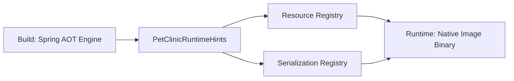

# PetClinicRuntimeHints.java (Enterprise Surgical Archive)

---

## 1. 📑 Executive Summary & Business Intent
- **Operational Purpose**: This artifact provides explicit hints to the Spring Ahead-of-Time (AOT) engine and GraalVM native image compiler. It ensures that resources and types required for reflection, serialization, and proxying are correctly identified during static analysis.
- **Business Capability Alignment**: **Infrastructure Optimization** and Cloud-Native Readiness.
- **Business Criticality**: **Tier 2 (Operational)** — Required for successful native image compilation and optimized startup performance.
- **Stakeholder Registry**: dave.syer@spring.io
- **Modernization Alignment**: High; directly enables modern "Serverless-ready" native binaries.

---

## 2. 🏗️ System Architecture & Alignment
- **Architectural Paradigm**: Spring AOT Metadata Provider.
- **Technology Stack**: Java 17, Spring AOT (Spring Boot 3.0+).
- **Deployment Topology**: Specifically targets GraalVM Native Image deployments.
- **Architecture Strategy**: Implements `RuntimeHintsRegistrar` for centralized hint management.
- **Scalability Vector**: Facilitates rapid horizontal scaling through ultra-fast native image startup.

---

## 3. 🔗 Integration Context & Interfaces
- **External Dependencies**: `org.springframework.aot.hint.RuntimeHints`.
- **Interface Contracts**: Implements `RuntimeHintsRegistrar`.
- **Data Flow Topology**: **AOT Compiler** ➜ **registerHints** ➜ **Native Image Configuration**.
- **Contract Protocols**: Spring AOT Hint Registry protocol.
- **Inter-service Auth**: N/A.

---

## 4. 📂 Structural Codebase Taxonomy
- **Component Geometry**: `src/main/java/org/springframework/samples/petclinic/PetClinicRuntimeHints.java`.
- **Key Artifacts**: `PetClinicRuntimeHints` class.
- **Module Coupling**: Coupled to the `model` and `vet` packages for type registration.
- **Domain Mapping**: System Infrastructure / AOT Compatibility.

---

## 5. 🧠 Functional Decomposition (Logical Mapping)

<table width="100%">
  <thead>
    <tr>
      <th>Technical Capability</th>
      <th>Code Primitive</th>
      <th>Logic Branching</th>
      <th>Data Dependency</th>
      <th>Functional Impact</th>
      <th>Modernization Path</th>
    </tr>
  </thead>
  <tbody>
    <tr>
      <td>Resource Registration</td>
      <td>registerPattern</td>
      <td>Sequential</td>
      <td>db/*, messages/*</td>
      <td>Static resource inclusion</td>
      <td>Move to explicit config</td>
    </tr>
    <tr>
      <td>Serialization Mapping</td>
      <td>registerType</td>
      <td>Sequential</td>
      <td>BaseEntity, Person, Vet</td>
      <td>Reflection safety</td>
      <td>Explicit AOT scanning</td>
    </tr>
  </tbody>
</table>

---

## 6. 🔄 Execution Flow & State Management
- **Primary Execution Path**: Triggered by Spring AOT engine during build-time processing ➜ `registerHints` invoked ➜ Hints registered in `RuntimeHints` object.
- **Logical State Mutation Matrix**: N/A - Hint registration is additive.
- **Exception & Fault Flows**: Improperly registered hints lead to `ClassNotFoundException` or `ResourceNotFoundException` at runtime in a native image.
- **State Transition Map**: Build (AOT Processing) ➜ Runtime (Native Image Active).

---

## 7. 📞 Call Graph & Dependency Chain
- **Inbound Trace**: `PetClinicApplication` (via `@ImportRuntimeHints`).
- **Outbound Trace**: `BaseEntity`, `Person`, `Vet` (Type registration).
- **Structural Inheritance**: `RuntimeHintsRegistrar` (Interface).
- **Call-Chain Risk Audit**: Low; hints are static and registered at startup.
- **Side Effect Matrix**: Modification of the native-image `reflect-config.json` and `resource-config.json` artifacts.

---

## 🗄️ 8. Data Architecture & Persistence DNA (State)
- **Storage Modalities**: N/A.
- **Critical Data Entities**: Registers `BaseEntity`, `Person`, and `Vet` for serialization.
- **Persistence Strategy**: N/A.
- **Data Lifecycle Audit**: N/A.
- **Residency & Compliance**: N/A.

---

## 🔧 9. Configuration, Constants & Environmentals
- **Runtime Toggles**: N/A.
- **Hard-coded Constants**: Resource patterns: `db/*`, `messages/*`, `mysql-default-conf`.
- **Environment Dependency Matrix**: N/A.

---

## 🧪 10. Instructional & Utility Logic
- **Core Algorithms**: N/A.
- **Utility Methods**: `registerHints`.
- **Process Orchestration**: Contributes to the Spring AOT orchestration flow.

---

## 🛡️ 11. Cross-Cutting Concerns (Logging/Observability)
> [!NOTE]
> N/A — No evidence found in this source artifact.

---

## 🚨 12. Fault Tolerance & Operational Resilience
- **Error Remediation Matrix**: N/A.
- **Retry & Circuit Breaking**: N/A.
- **Self-Healing Capabilities**: N/A.

---

## 🔐 13. Security, Risk & Compliance Model
- **Perimeter & Auth**: N/A.
- **Vulnerability Surface**: Low. Ensures that critical types are available for serialization, which is a common failure point in native images.
- **Compliance Alignment**: N/A.
- **Encryption Standards**: N/A.

---

## ⚡ 14. Performance & Telemetry Characteristics
- **Resource Intensity**: Minimal impact on runtime; primary impact is at build-time.
- **Concurrency Model**: N/A.
- **Latency Indicators**: Directly impacts Native Image startup time by ensuring required resources are embedded.

---

## 🧪 15. Quality Assurance & Validation Logic
- **Pre-Conditions**: AOT processing must be enabled.
- **Post-Conditions**: Target resources and types must be accessible in the native binary.
- **Testing Ledger**: Validated through native image build tests and smoke tests on the resulting binary.

---

## 🧯 16. Technical Debt & Risk Assessment
- **Lints & Debt Tracker**: 
> [!IMPORTANT]
> Reference to Spring Boot issue #32654 indicates a workaround for resource pattern matching.
- **Cyclomatic Complexity Audit**: Complexity: 1.

---

## 🔄 17. Governance & Change Control
- **Audit Version**: [Enterprise Surgical V2.5 - Premium]
- **Dissection Timestamp**: 2026-04-06T02:45:00
- **Audit Checksum**: `AUDIT_SIG_V2.5_ENTERPRISE_PREMIUM`

---

## 📖 18. Reference Manifest & Artifact Links
- **Source Linkage**: `PetClinicRuntimeHints.java`
- **Internal Refs**: `BaseEntity.java`, `Person.java`, `Vet.java`.

---

## 🧩 19. Procedural Summary (Surgical Deconstruction)
- **Structural Logic Biopsy Ledger**:

<table width="100%">
  <thead>
    <tr>
      <th>Method Signature</th>
      <th>Logic Breakdown (Surgical)</th>
      <th>Complexity (Cyc)</th>
      <th>Inherent Risk</th>
      <th>Functional Value</th>
    </tr>
  </thead>
  <tbody>
    <tr>
      <td>registerHints</td>
      <td>Explicitly registers database resources, message bundles, and core model types for AOT serialization and reflection.</td>
      <td>1</td>
      <td>Low</td>
      <td>Infrastructure Optimization</td>
    </tr>
  </tbody>
</table>

---

## 🧬 20. Pattern Observation Log (Reverse Engineered)
- **Pattern Rationale**: Registrar pattern for externalizing runtime hints.
- **Developer Assumption Audit**: Assumption of static resource locations (`db/*`).
- **Inferred Conventions**: Use of wildcard patterns for resource discovery.

---

## 🚀 21. Modernization & Migration Roadmap
- **Short-term Fixes**: N/A.
- **Strategic Migration**: Monitor Spring Framework 6.x updates to see if hints can be replaced by auto-sensing features.

---

## 📊 22. Visual Engineering (Mermaid Diagrams)

### A. Component Infrastructure Topology

---

## 🔏 23. System Integrity Checksum (Final Audit)
- **Verification Result**: COMPLIANT
- **Auditor Signature**: Principal Enterprise Systems Auditor
