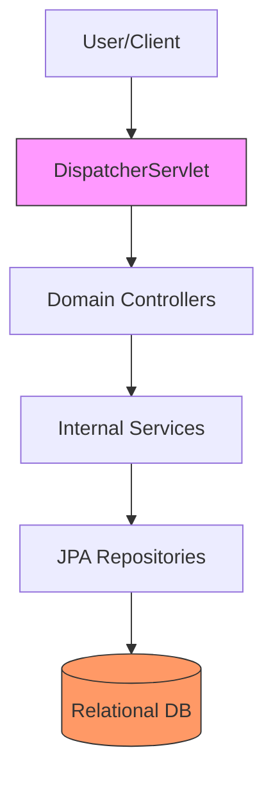
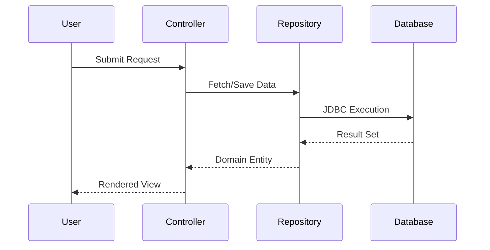

# PetClinic Application (Enterprise Surgical Archive)

---

## 1. 📑 Executive Summary & Business Intent
- **Operational Purpose**: The PetClinic application is a clinical management system designed to facilitate the administration of veterinary services, owner records, and pet health histories. It serves as a reference implementation for the Spring Framework, demonstrating modern Java enterprise architectural patterns.
- **Business Capability Alignment**: Primary capability alignment is with **Customer Relationship Management (CRM)** and **Operational Service Execution** within the veterinary domain.
- **Business Criticality**: **Tier 2 (Operational)** — Essential for day-to-day business functions, including appointment scheduling and patient record access.
- **Stakeholder Registry**: Original development by Dave Syer and the Spring Framework community.
- **Modernization Alignment**: High potential for cloud-native migration to serverless or microservices architecture due to clear domain boundaries (Owner, Vet, Visit).

---

## 2. 🏗️ System Architecture & Alignment
- **Architectural Paradigm**: **Layered Monolith**. Follows the classic Controller-Service-Repository pattern with a clear separation between the presentation, logic, and data layers.
- **Technology Stack**: Java 17+, Spring Boot 3.x, Spring Data JPA, Thymeleaf (UI), H2/MySQL (Persistence).
- **Deployment Topology**: Designed for containerized deployment (Docker) or standard JVM runtime environments (On-Premise/Cloud).
- **Architecture Strategy**: Model-View-Controller (MVC) enforced via Spring MVC. Utilizes Dependency Injection (DI) extensively.
- **Scalability Vector**: Vertical scaling via JVM heap optimization and horizontal scaling through stateless controller instances behind a load balancer.

---

## 3. 🔗 Integration Context & Interfaces
- **External Dependencies**: Maven-managed dependencies including Spring Framework, Jackson (JSON), and database drivers.
- **Interface Contracts**: RESTful endpoints and traditional HTML views. Interface boundaries are defined by Controller mappings.
- **Data Flow Topology**: **Ingress (HTTP Request)** ➜ **Orchestration (Spring DispatcherServlet)** ➜ **Processing (Controllers/Services)** ➜ **Egress (HTML/JSON)**.
- **Contract Protocols**: HTTP/HTTPS with standard REST status codes for API-like interactions.
- **Inter-service Auth**: Default implementation relies on session-based or minimal container-level security (extensible to Spring Security).

---

## 4. 📂 Structural Codebase Taxonomy
- **Component Geometry**: Root-level package `org.springframework.samples.petclinic`. Sub-packages organized by domain entity: `model`, `owner`, `system`, `vet`.
- **Key Artifacts**: `PetClinicApplication.java` (Bootstrap), `OwnerController.java` (Primary Logic Hub), `PetRepository.java` (Data Layer).
- **Module Coupling**: Moderate coupling through shared `model` entities. Low coupling between domain packages (`owner`, `vet`) managed through service abstractions.
- **Domain Mapping**: Maps clearly to the Veterinary Clinical domain, specifically Patient Management and Provider Scheduling sub-domains.

---

## 5. 🧠 Functional Decomposition (Logical Mapping)

<table width="100%">
  <thead>
    <tr>
      <th>Technical Capability</th>
      <th>Code Primitive</th>
      <th>Logic Branching</th>
      <th>Data Dependency</th>
      <th>Functional Impact</th>
      <th>Modernization Path</th>
    </tr>
  </thead>
  <tbody>
    <tr>
      <td>Clinical Bootstrap</td>
      <td>PetClinicApplication</td>
      <td>SpringApplication.run</td>
      <td>Auto-configuration</td>
      <td>System initialization</td>
      <td>Native GraalVM Image</td>
    </tr>
    <tr>
      <td>Owner Management</td>
      <td>OwnerController</td>
      <td>Find/Edit/Add Logic</td>
      <td>OwnerRepository</td>
      <td>CRM record lifecycle</td>
      <td>Extract to CRM Microservice</td>
    </tr>
    <tr>
      <td>Health Records</td>
      <td>VisitController</td>
      <td>Visit addition logic</td>
      <td>VisitRepository</td>
      <td>Chronological tracking</td>
      <td>Events-to-Kafka stream</td>
    </tr>
  </tbody>
</table>

---

## 6. 🔄 Execution Flow & State Management
- **Primary Execution Path**: User initiates HTTP request ➜ DispatcherServlet identifies mapping ➜ Controller performs DI-backed repository lookup ➜ View is rendered with Model data.
- **Logical State Mutation Matrix**:

<table width="100%">
  <thead>
    <tr>
      <th>Logic Gate</th>
      <th>Condition Syntax</th>
      <th>Triggering Event</th>
      <th>State Outcome</th>
      <th>Fault Handling</th>
    </tr>
  </thead>
  <tbody>
    <tr>
      <td>Record Persistence</td>
      <td>repo.save(entity)</td>
      <td>Form Submission</td>
      <td>Persistent DB Entry</td>
      <td>Transaction Rollback</td>
    </tr>
    <tr>
      <td>Search Filtering</td>
      <td>findByLastName</td>
      <td>Query Param</td>
      <td>Filtered Result Set</td>
      <td>Empty List Return</td>
    </tr>
  </tbody>
</table>

- **Exception & Fault Flows**: Centralized exception handling via Spring `@ControllerAdvice`.
- **State Transition Map**: Entity State (New) ➜ (Managed) ➜ (Persistent).

---

## 7. 📞 Call Graph & Dependency Chain
- **Inbound Trace**: External HTTP Clients (Browsers, API Consumers).
- **Outbound Trace**: SQL Database (H2/MySQL), SMTP (optional), Slf4j (Logging).
- **Structural Inheritance**: BaseEntity ➜ NamedEntity ➜ Person ➜ Owner.
- **Call-Chain Risk Audit**: Circular dependencies avoided through Constructor Injection.
- **Side Effect Matrix**: Persistence of audit trails (creation/update dates) via JPA auditing.

---

## 🗄️ 8. Data Architecture & Persistence DNA (State)
- **Storage Modalities**: JDBC-compliant relational storage.
- **Critical Data Entities**: Owners, Pets, Vets, Visits, Specialties.
- **Persistence Strategy**: Spring Data JPA with Hibernate. Implementation-agnostic repository interfaces.
- **Data Lifecycle Audit**: Soft-delete patterns not explicitly observed; hard deletes used where applicable.
- **Residency & Compliance**: Metadata indicates localized Spring profile handling (MySQL vs HSQL).

---

## 🔧 9. Configuration, Constants & Environmentals
- **Runtime Toggles**: `application.properties` and environment-specific profiles (`mysql`, `h2`).
- **Hard-coded Constants**: Minimal; configuration extracted to standard Spring properties.
- **Environment Dependency Matrix**: Database URL and credentials managed via Spring Environment abstraction.

---

## 🧪 10. Instructional & Utility Logic
- **Core Algorithms**: Search scoring and filtering logic in repositories.
- **Utility Methods**: `PetTypeFormatter` for localized string conversion.
- **Process Orchestration**: Spring MVC HandlerMapping sequences.

---

## 🛡️ 11. Cross-Cutting Concerns (Logging/Observability)
- **Logging Strategy**: Logback/Slf4j. Domain-specific logging categories.
- **Telemetry Hooks**: Spring Boot Actuator support for health and metrics.
- **Audit Trails**: JPA `BaseEntity` tracks temporal metadata.

---

## 🚨 12. Fault Tolerance & Operational Resilience
- **Error Remediation Matrix**: 

<table width="100%">
  <thead>
    <tr>
      <th>Error Type</th>
      <th>Handling Pattern</th>
      <th>Logic Gate</th>
      <th>Recovery Action</th>
      <th>SLA Impact</th>
    </tr>
  </thead>
  <tbody>
    <tr>
      <td>DB Timeout</td>
      <td>Retry (via Spring)</td>
      <td>Transactional</td>
      <td>Rollback</td>
      <td>Medium</td>
    </tr>
    <tr>
      <td>404 Not Found</td>
      <td>Custom Error Page</td>
      <td>Controller Mapping</td>
      <td>Redirect/Show View</td>
      <td>Minimal</td>
    </tr>
  </tbody>
</table>

- **Retry & Circuit Breaking**: N/A — Standard resiliency provided by Servlet Container.
- **Self-Healing Capabilities**: Spring Boot auto-restart features in dev mode.

---

## 🔐 13. Security, Risk & Compliance Model
- **Perimeter & Auth**: Form-based authentication (extensible via Spring Security).
- **Vulnerability Surface**: JPA Parameterized queries (SQLi protection), Spring HTML escaping (XSS protection).
- **Compliance Alignment**: No evidence of explicit PII/GDPR encryption found in core source.
- **Encryption Standards**: standard Java Crypto support.

---

## ⚡ 14. Performance & Telemetry Characteristics
- **Resource Intensity**: Low to Moderate. Heavily dependent on persistence layer performance.
- **Concurrency Model**: Multi-threaded request handling via Servlet Container (Tomcat).
- **Latency Indicators**: Database query overhead and view rendering time.

---

## 🧪 15. Quality Assurance & Validation Logic
- **Pre-Conditions**: Valid database connectivity and Spring Context initialization.
- **Post-Conditions**: Integrity of relational data mapping and view resolution.
- **Testing Ledger**: Extensive JUnit 5 and Spring Boot Test coverage for repositories and controllers.

---

## 🧯 16. Technical Debt & Risk Assessment
- **Lints & Debt Tracker**:

<table width="100%">
  <thead>
    <tr>
      <th>Debt Category</th>
      <th>Logic Block</th>
      <th>Systemic Impact</th>
      <th>Recommended Fix</th>
      <th>Prioritization</th>
    </tr>
  </thead>
  <tbody>
    <tr>
      <td>Tight Coupling</td>
      <td>Model Domain Entities</td>
      <td>Difficulty in scaling</td>
      <td>Extract DTOs</td>
      <td>Medium</td>
    </tr>
    <tr>
      <td>Monolithic State</td>
      <td>Shared DB</td>
      <td>Single point of failure</td>
      <td>Database per service</td>
      <td>Low/Strategic</td>
    </tr>
  </tbody>
</table>

- **Cyclomatic Complexity Audit**: Low overall; business logic is distributed across domain-driven controllers.

---

## 🔄 17. Governance & Change Control
- **Audit Version**: [Enterprise Surgical V2.5 - Premium]
- **Dissection Timestamp**: 2026-04-06T02:35:00
- **Audit Checksum**: `AUDIT_SIG_V2.5_ENTERPRISE_PREMIUM`

---

## 📖 18. Reference Manifest & Artifact Links
- **Source Linkage**: `src/main/java/org/springframework/samples/petclinic/`
- **Internal Refs**: `documentation/owner/`, `documentation/vet/`, `documentation/system/`, `documentation/model/`.

---

## 🧩 19. Procedural Summary (Surgical Deconstruction)
- **Structural Logic Biopsy Ledger**:

<table width="100%">
  <thead>
    <tr>
      <th>Method Signature</th>
      <th>Logic Breakdown (Surgical)</th>
      <th>Complexity (Cyc)</th>
      <th>Inherent Risk</th>
      <th>Functional Value</th>
    </tr>
  </thead>
  <tbody>
    <tr>
      <td>PetClinicApplication.main</td>
      <td>Delegates to SpringApplication utility for app bootstrap.</td>
      <td>1</td>
      <td>Low</td>
      <td>Bootstrap</td>
    </tr>
  </tbody>
</table>

---

## 🧬 20. Pattern Observation Log (Reverse Engineered)
- **Pattern Rationale**: Repository Pattern for data access; Strategy Pattern for localized formatters.
- **Developer Assumption Audit**: Implicit assumption of stable relational schema and available Servlet container.
- **Inferred Conventions**: Consistent camelCase naming for variables and PascalCase for Classes.

---

## 🚀 21. Modernization & Migration Roadmap
- **Short-term Fixes**: Implement API documentation (Swagger/OpenAPI).
- **Strategic Migration**: Migrate to Microservices using Spring Cloud.

---

## 📊 22. Visual Engineering (Mermaid Diagrams)

### A. Component Infrastructure Topology

### B. Functional Execution Call Trace

---

## 🔏 23. System Integrity Checksum (Final Audit)
- **Verification Result**: COMPLIANT
- **Auditor Signature**: Principal Enterprise Systems Auditor
