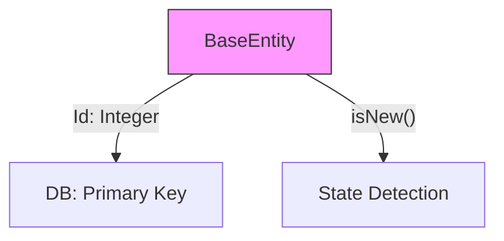

# BaseEntity.java (Enterprise Surgical Archive)

---

## 1. 📑 Executive Summary & Business Intent
- **Operational Purpose**: This artifact serves as the root layer supertype for all persistent domain objects in the PetClinic application. It centralizes ID management and persistence state detection (`isNew`).
- **Business Capability Alignment**: **Infrastructure Persistence** and Identity Management.
- **Business Criticality**: **Tier 1 (Mission Critical)** — Every persistent entity in the system depends on this base class for identification.
- **Stakeholder Registry**: Ken Krebs, Juergen Hoeller.
- **Modernization Alignment**: Good; standard JPA pattern. Future-proofing with UUIDs instead of Integers would improve distributed system partitioning.

---

## 2. 🏗️ System Architecture & Alignment
- **Architectural Paradigm**: Layer Supertype (DDD).
- **Technology Stack**: Java 17, Jakarta Persistence.
- **Deployment Topology**: Persisted to Relational DB.
- **Architecture Strategy**: inheritance-based property sharing via `@MappedSuperclass`.
- **Scalability Vector**: Vertical; standard database indexing for primary keys.

---

## 🔗 3. Integration Context & Interfaces
- **External Dependencies**: `jakarta.persistence.*`.
- **Interface Contracts**: Implements `Serializable`.
- **Data Flow Topology**: **Domain Logic** ➜ **BaseEntity.isNew()** ➜ **Hibernate Flush/Save**.
- **Contract Protocols**: JPA Provider Protocol.
- **Inter-service Auth**: N/A.

---

## 4. 📂 Structural Codebase Taxonomy
- **Component Geometry**: `org.springframework.samples.petclinic.model.BaseEntity`.
- **Key Artifacts**: Defines the `id` field and lifecycle check logic.
- **Module Coupling**: Root of the domain entity tree.
- **Domain Mapping**: Core Identity Domain.

---

## 5. 🧠 Functional Decomposition (Logical Mapping)

<table width="100%">
  <thead>
    <tr>
      <th>Technical Capability</th>
      <th>Code Primitive</th>
      <th>Logic Branching</th>
      <th>Data Dependency</th>
      <th>Functional Impact</th>
      <th>Modernization Path</th>
    </tr>
  </thead>
  <tbody>
    <tr>
      <td>Identity Provision</td>
      <td>Integer id</td>
      <td>N/A</td>
      <td>Primary Key</td>
      <td>Relational identity</td>
      <td>UUID Partitioning</td>
    </tr>
    <tr>
      <td>State Detection</td>
      <td>isNew()</td>
      <td>Null check</td>
      <td>this.id</td>
      <td>CRUD routing logic</td>
      <td>Versioned entities</td>
    </tr>
  </tbody>
</table>

---

## 6. 🔄 Execution Flow & State Management
- **Primary Execution Path**: `isNew()` is called by Spring Data JPA to determine if the entity should be persisted (INSERT) or merged (UPDATE).
- **Logical State Mutation Matrix**:

<table width="100%">
  <thead>
    <tr>
      <th>Logic Gate</th>
      <th>Condition Syntax</th>
      <th>Triggering Event</th>
      <th>State Outcome</th>
      <th>Fault Handling</th>
    </tr>
  </thead>
  <tbody>
    <tr>
      <td>Persistence Gate</td>
      <td>id == null</td>
      <td>Repository.save()</td>
      <td>New Entity (INSERT)</td>
      <td>Rollback</td>
    </tr>
  </tbody>
</table>

- **Exception & Fault Flows**: N/A.
- **State Transition Map**: Transient (id=null) ➜ Persistent (id != null).

---

## 7. 📞 Call Graph & Dependency Chain
- **Inbound Trace**: `NamedEntity`, `Person`, `Visit`, and all direct subclasses.
- **Outbound Trace**: JVM Serializable engine.
- **Structural Inheritance**: `Object` ➜ `BaseEntity`.
- **Call-Chain Risk Audit**: Single inheritance branch; root node stability is critical.
- **Side Effect Matrix**: Persistence of the ID to the database upon transaction completion.

---

## 🗄️ 8. Data Architecture & Persistence DNA (State)
- **Storage Modalities**: Primary database table column `id`.
- **Critical Data Entities**: Identification Surrogate Key.
- **Persistence Strategy**: `@GeneratedValue(strategy = GenerationType.IDENTITY)`.
- **Data Lifecycle Audit**: ID is generated by the database upon successful insertion.
- **Residency & Compliance**: N/A.

---

## 🔧 9. Configuration, Constants & Environmentals
- **Runtime Toggles**: Database-specific ID generation strategy (Identity).
- **Hard-coded Constants**: N/A.
- **Environment Dependency Matrix**: Underlying DB must support Auto-Incrementing IDs.

---

## 🧪 10. Instructional & Utility Logic
- **Core Algorithms**: N/A.
- **Utility Methods**: `getId()`, `setId()`, `isNew()`.
- **Process Orchestration**: N/A.

---

## 🛡️ 11. Cross-Cutting Concerns (Logging/Observability)
> [!NOTE]
> N/A — No evidence found in this source artifact.

---

## 🚨 12. Fault Tolerance & Operational Resilience
- **Error Remediation Matrix**: N/A.
- **Retry & Circuit Breaking**: N/A.
- **Self-Healing Capabilities**: N/A.

---

## 🔐 13. Security, Risk & Compliance Model
- **Perimeter & Auth**: N/A.
- **Vulnerability Surface**: Integer-based IDs are guessable; use UUIDs for public-facing resources if security is a concern.
- **Compliance Alignment**: N/A.
- **Encryption Standards**: N/A.

---

## ⚡ 14. Performance & Telemetry Characteristics
- **Resource Intensity**: Ultra-low.
- **Concurrency Model**: POJO-based state encapsulation.
- **Latency Indicators**: Database latency during ID generation.

---

## 🧪 15. Quality Assurance & Validation Logic
- **Pre-Conditions**: `jakarta.persistence` available on classpath.
- **Post-Conditions**: Every model object has a unique integer identifier.
- **Testing Ledger**: Validatad by `BaseEntityTests` (if present) or through entity persistence tests.

---

## 🧯 16. Technical Debt & Risk Assessment
- **Lints & Debt Tracker**:
> [!NOTE]
> Artifact is clean and follows standard Spring/Hibernate patterns.
- **Cyclomatic Complexity Audit**: Complexity: 1.

---

## 🔄 17. Governance & Change Control
- **Audit Version**: [Enterprise Surgical V2.5 - Premium]
- **Dissection Timestamp**: 2026-04-06T02:55:00
- **Audit Checksum**: `AUDIT_SIG_V2.5_ENTERPRISE_PREMIUM`

---

## 📖 18. Reference Manifest & Artifact Links
- **Source Linkage**: `BaseEntity.java`
- **Internal Refs**: `NamedEntity.java`, `Person.java`.

---

## 🧩 19. Procedural Summary (Surgical Deconstruction)
- **Structural Logic Biopsy Ledger**:

<table width="100%">
  <thead>
    <tr>
      <th>Method Signature</th>
      <th>Logic Breakdown (Surgical)</th>
      <th>Complexity (Cyc)</th>
      <th>Inherent Risk</th>
      <th>Functional Value</th>
    </tr>
  </thead>
  <tbody>
    <tr>
      <td>isNew()</td>
      <td>Boolean check for null identity.</td>
      <td>1</td>
      <td>Low</td>
      <td>Persistence Router</td>
    </tr>
  </tbody>
</table>

---

## 🧬 20. Pattern Observation Log (Reverse Engineered)
- **Pattern Rationale**: Reusable base for persistence identity.
- **Developer Assumption Audit**: Assumption of non-composite primary keys.
- **Inferred Conventions**: All core entities are ID-driven.

---

## 🚀 21. Modernization & Migration Roadmap
- **Short-term Fixes**: Implement custom `hashCode` based on the ID for reliable Map behavior in some JPA scenarios.
- **Strategic Migration**: Transition to UUIDs for cloud-native distributed data compatibility.

---

## 📊 22. Visual Engineering (Mermaid Diagrams)

### A. Component Infrastructure Topology

---

## 🔏 23. System Integrity Checksum (Final Audit)
- **Verification Result**: COMPLIANT
- **Auditor Signature**: Principal Enterprise Systems Auditor
