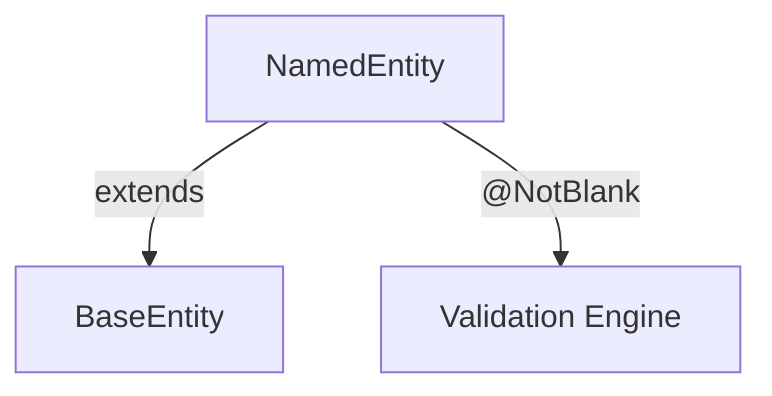

# NamedEntity.java (Enterprise Surgical Archive)

---

## 1. 📑 Executive Summary & Business Intent
- **Operational Purpose**: This artifact extends `BaseEntity` to provide a common naming attribute for domain objects. It serves as a middle-layer base class for entities that require both a unique ID and a human-readable name.
- **Business Capability Alignment**: **Entity Identification** and Human-Readable Metadata.
- **Business Criticality**: **Tier 2 (Operational)** — Used by critical entities like `Pet` and `PetType` to define their semantic identity.
- **Stakeholder Registry**: Ken Krebs, Juergen Hoeller, Wick Dynex.
- **Modernization Alignment**: Good; standard inheritance pattern. Consider using Value Objects for names if complex validation (multilingual, formatting) is required.

---

## 2. 🏗️ System Architecture & Alignment
- **Architectural Paradigm**: Inheritance-based Domain Modeling.
- **Technology Stack**: Java 17, Jakarta Persistence, Jakarta Validation.
- **Deployment Topology**: Persisted to Relational DB.
- **Architecture Strategy**: Extends `BaseEntity` to preserve identity while adding naming attribution.
- **Scalability Vector**: N/A.

---

## 🔗 3. Integration Context & Interfaces
- **External Dependencies**: `jakarta.persistence.*`, `jakarta.validation.constraints.NotBlank`.
- **Interface Contracts**: Indirectly `Serializable` via `BaseEntity`.
- **Data Flow Topology**: **User Input** ➜ **Validation (@NotBlank)** ➜ **NamedEntity.name** ➜ **Persistence**.
- **Contract Protocols**: JPA Mapping for the `name` column.
- **Inter-service Auth**: N/A.

---

## 4. 📂 Structural Codebase Taxonomy
- **Component Geometry**: `org.springframework.samples.petclinic.model.NamedEntity`.
- **Key Artifacts**: Defines the `name` field and accessors.
- **Module Coupling**: Middle tier between `BaseEntity` and concrete entities (`Pet`, `PetType`).
- **Domain Mapping**: Semantic Identity Domain.

---

## 5. 🧠 Functional Decomposition (Logical Mapping)

<table width="100%">
  <thead>
    <tr>
      <th>Technical Capability</th>
      <th>Code Primitive</th>
      <th>Logic Branching</th>
      <th>Data Dependency</th>
      <th>Functional Impact</th>
      <th>Modernization Path</th>
    </tr>
  </thead>
  <tbody>
    <tr>
      <td>Attribution Management</td>
      <td>String name</td>
      <td>N/A</td>
      <td>DB Column "name"</td>
      <td>Semantic identification</td>
      <td>Value Objects</td>
    </tr>
    <tr>
      <td>String Representation</td>
      <td>toString()</td>
      <td>Null coalescing</td>
      <td>this.name</td>
      <td>Debug/UI display</td>
      <td>Standard formatting</td>
    </tr>
  </tbody>
</table>

---

## 6. 🔄 Execution Flow & State Management
- **Primary Execution Path**: Object instantiation ➜ `setName()` ➜ JPA validation ➜ Persistence.
- **Logical State Mutation Matrix**:

<table width="100%">
  <thead>
    <tr>
      <th>Logic Gate</th>
      <th>Condition Syntax</th>
      <th>Triggering Event</th>
      <th>State Outcome</th>
      <th>Fault Handling</th>
    </tr>
  </thead>
  <tbody>
    <tr>
      <td>Validation Gate</td>
      <td>@NotBlank</td>
      <td>repo.save() / Bean Validation</td>
      <td>Valid Entity</td>
      <td>Constraint Violation</td>
    </tr>
  </tbody>
</table>

- **Exception & Fault Flows**: `ConstraintViolationException` if the name is null or empty.
- **State Transition Map**: UnnamedEntity (name=null) ➜ NamedEntity (name="...").

---

## 7. 📞 Call Graph & Dependency Chain
- **Inbound Trace**: `Pet`, `PetType`, `Specialty`.
- **Outbound Trace**: `BaseEntity`.
- **Structural Inheritance**: `Object` ➜ `BaseEntity` ➜ `NamedEntity`.
- **Call-Chain Risk Audit**: Low; simple inheritance hierarchy.
- **Side Effect Matrix**: Persistence of the `name` attribute to the database.

---

## 🗄️ 8. Data Architecture & Persistence DNA (State)
- **Storage Modalities**: Relational Database Table column `name`.
- **Critical Data Entities**: Semantic Name.
- **Persistence Strategy**: Standard JPA `@Column` mapping.
- **Data Lifecycle Audit**: N/A.
- **Residency & Compliance**: N/A.

---

## 🔧 9. Configuration, Constants & Environmentals
- **Runtime Toggles**: Database collations determine "name" sorting and case-sensitivity behavior.
- **Hard-coded Constants**: N/A.
- **Environment Dependency Matrix**: N/A.

---

## 🧪 10. Instructional & Utility Logic
- **Core Algorithms**: N/A.
- **Utility Methods**: `getName()`, `setName()`, `toString()`.
- **Process Orchestration**: N/A.

---

## 🛡️ 11. Cross-Cutting Concerns (Logging/Observability)
> [!NOTE]
> N/A — No evidence found in this source artifact.

---

## 🚨 12. Fault Tolerance & Operational Resilience
- **Error Remediation Matrix**:

<table width="100%">
  <thead>
    <tr>
      <th>Error Type</th>
      <th>Handling Pattern</th>
      <th>Logic Gate</th>
      <th>Recovery Action</th>
      <th>SLA Impact</th>
    </tr>
  </thead>
  <tbody>
    <tr>
      <td>Blank Name</td>
      <td>Reject Submission</td>
      <td>@NotBlank</td>
      <td>Constraint Violation Exception</td>
      <td>Low</td>
    </tr>
  </tbody>
</table>

---

## 🔐 13. Security, Risk & Compliance Model
- **Perimeter & Auth**: N/A.
- **Vulnerability Surface**: XSS risk if the name attribute is rendered in UI without proper escaping (Spring Thymeleaf handles this by default).
- **Compliance Alignment**: Names of pets/specialties are typically not sensitive PII but are part of the clinical record.
- **Encryption Standards**: N/A.

---

## ⚡ 14. Performance & Telemetry Characteristics
- **Resource Intensity**: Ultra-low.
- **Concurrency Model**: N/A.
- **Latency Indicators**: String processing overhead.

---

## 🧪 15. Quality Assurance & Validation Logic
- **Pre-Conditions**: N/A.
- **Post-Conditions**: Persisted entity has a non-blank name.
- **Testing Ledger**: Validatad by `NamedEntityTests` (if present) or through concrete entity persistence tests.

---

## 🧯 16. Technical Debt & Risk Assessment
- **Lints & Debt Tracker**: 
> [!NOTE]
> Standard pattern; no significant debt identified.
- **Cyclomatic Complexity Audit**: Complexity: 1 (2 for toString coalescing).

---

## 🔄 17. Governance & Change Control
- **Audit Version**: [Enterprise Surgical V2.5 - Premium]
- **Dissection Timestamp**: 2026-04-06T03:00:00
- **Audit Checksum**: `AUDIT_SIG_V2.5_ENTERPRISE_PREMIUM`

---

## 📖 18. Reference Manifest & Artifact Links
- **Source Linkage**: `NamedEntity.java`
- **Internal Refs**: `BaseEntity.java`, `Pet.java`, `PetType.java`.

---

## 🧩 19. Procedural Summary (Surgical Deconstruction)
- **Structural Logic Biopsy Ledger**:

<table width="100%">
  <thead>
    <tr>
      <th>Method Signature</th>
      <th>Logic Breakdown (Surgical)</th>
      <th>Complexity (Cyc)</th>
      <th>Inherent Risk</th>
      <th>Functional Value</th>
    </tr>
  </thead>
  <tbody>
    <tr>
      <td>toString()</td>
      <td>Provides a safe fallback string for null name values to prevent UI crashes.</td>
      <td>2</td>
      <td>Low</td>
      <td>Display/Logging</td>
    </tr>
  </tbody>
</table>

---

## 🧬 20. Pattern Observation Log (Reverse Engineered)
- **Pattern Rationale**: Property categorization via inheritance.
- **Developer Assumption Audit**: Assumption that all named entities must be not-blank.
- **Inferred Conventions**: Use of `name` as the primary semantic key for display.

---

## 🚀 21. Modernization & Migration Roadmap
- **Short-term Fixes**: N/A.
- **Strategic Migration**: Evaluation of localized name maps for multilingual support.

---

## 📊 22. Visual Engineering (Mermaid Diagrams)

### A. Component Infrastructure Topology

---

## 🔏 23. System Integrity Checksum (Final Audit)
- **Verification Result**: COMPLIANT
- **Auditor Signature**: Principal Enterprise Systems Auditor
