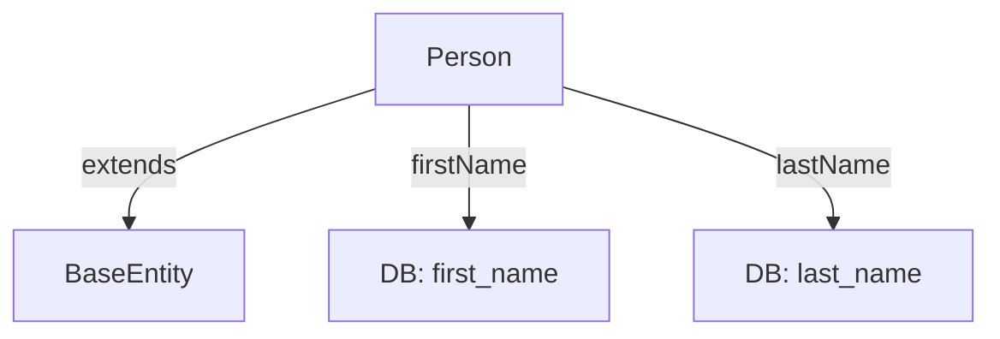

# Person.java (Enterprise Surgical Archive)

---

## 1. 📑 Executive Summary & Business Intent
- **Operational Purpose**: This artifact represents the base entity for human actors within the PetClinic system (Owners and Veterinarians). It centralizes the storage and validation of personal attributes such as first and last names.
- **Business Capability Alignment**: **Actor Identity Management** and Personal Data Administration.
- **Business Criticality**: **Tier 1 (Mission Critical)** — Core identification logic for both service providers (Vets) and clients (Owners).
- **Stakeholder Registry**: Ken Krebs.
- **Modernization Alignment**: Good; standard inheritance pattern. Consider data normalization or encryption for PII compliance in later phases.

---

## 2. 🏗️ System Architecture & Alignment
- **Architectural Paradigm**: Inheritance-based Actor Modeling.
- **Technology Stack**: Java 17, Jakarta Persistence, Jakarta Validation.
- **Deployment Topology**: Persisted to Relational DB.
- **Architecture Strategy**: Extends `BaseEntity` to provide shared actor attributes to concrete human subclasses.
- **Scalability Vector**: N/A.

---

## 🔗 3. Integration Context & Interfaces
- **External Dependencies**: `jakarta.persistence.*`, `jakarta.validation.constraints.NotBlank`.
- **Interface Contracts**: Indirectly `Serializable` via `BaseEntity`.
- **Data Flow Topology**: **User Input** ➜ **Validation (@NotBlank)** ➜ **Person.firstName / Person.lastName** ➜ **Persistence**.
- **Contract Protocols**: JPA Mapping for the `firstName` and `lastName` columns.
- **Inter-service Auth**: N/A.

---

## 4. 📂 Structural Codebase Taxonomy
- **Component Geometry**: `org.springframework.samples.petclinic.model.Person`.
- **Key Artifacts**: Defines the `firstName` and `lastName` fields and accessors.
- **Module Coupling**: Parent class for `Owner` and `Vet`.
- **Domain Mapping**: Personal Identity Domain.

---

## 5. 🧠 Functional Decomposition (Logical Mapping)

<table width="100%">
  <thead>
    <tr>
      <th>Technical Capability</th>
      <th>Code Primitive</th>
      <th>Logic Branching</th>
      <th>Data Dependency</th>
      <th>Functional Impact</th>
      <th>Modernization Path</th>
    </tr>
  </thead>
  <tbody>
    <tr>
      <td>Personal Attribution</td>
      <td>String firstName, lastName</td>
      <td>N/A</td>
      <td>DB Columns</td>
      <td>Personal identification</td>
      <td>Encrypted PII store</td>
    </tr>
  </tbody>
</table>

---

## 6. 🔄 Execution Flow & State Management
- **Primary Execution Path**: Object instantiation ➜ `setFirstName/setLastName()` ➜ JPA validation ➜ Persistence.
- **Logical State Mutation Matrix**:

<table width="100%">
  <thead>
    <tr>
      <th>Logic Gate</th>
      <th>Condition Syntax</th>
      <th>Triggering Event</th>
      <th>State Outcome</th>
      <th>Fault Handling</th>
    </tr>
  </thead>
  <tbody>
    <tr>
      <td>Validation Gate</td>
      <td>@NotBlank</td>
      <td>repo.save() / Bean Validation</td>
      <td>Valid Entity</td>
      <td>Constraint Violation</td>
    </tr>
  </tbody>
</table>

- **Exception & Fault Flows**: `ConstraintViolationException` if names are missing or blank.
- **State Transition Map**: AnonymousActor ➜ NamedActor.

---

## 7. 📞 Call Graph & Dependency Chain
- **Inbound Trace**: `Owner`, `Vet`.
- **Outbound Trace**: `BaseEntity`.
- **Structural Inheritance**: `Object` ➜ `BaseEntity` ➜ `Person`.
- **Call-Chain Risk Audit**: Low; standard inheritance hierarchy.
- **Side Effect Matrix**: Persistence of personal attributes to the database.

---

## 🗄️ 8. Data Architecture & Persistence DNA (State)
- **Storage Modalities**: Relational Database Table columns `first_name` and `last_name`.
- **Critical Data Entities**: PII (Personally Identifiable Information).
- **Persistence Strategy**: Standard JPA `@Column` mapping.
- **Data Lifecycle Audit**: N/A.
- **Residency & Compliance**: Higher scrutiny required for PII data residency in cloud environments.

---

## 🔧 9. Configuration, Constants & Environmentals
- **Runtime Toggles**: N/A.
- **Hard-coded Constants**: N/A.
- **Environment Dependency Matrix**: N/A.

---

## 🧪 10. Instructional & Utility Logic
- **Core Algorithms**: N/A.
- **Utility Methods**: Accessors for all personal fields.
- **Process Orchestration**: N/A.

---

## 🛡️ 11. Cross-Cutting Concerns (Logging/Observability)
> [!NOTE]
> N/A — No evidence found in this source artifact.

---

## 🚨 12. Fault Tolerance & Operational Resilience
- **Error Remediation Matrix**:

<table width="100%">
  <thead>
    <tr>
      <th>Error Type</th>
      <th>Handling Pattern</th>
      <th>Logic Gate</th>
      <th>Recovery Action</th>
      <th>SLA Impact</th>
    </tr>
  </thead>
  <tbody>
    <tr>
      <td>Blank Detail</td>
      <td>Reject Submission</td>
      <td>@NotBlank</td>
      <td>Validation Error</td>
      <td>Low</td>
    </tr>
  </tbody>
</table>

---

## 🔐 13. Security, Risk & Compliance Model
- **Perimeter & Auth**: N/A.
- **Vulnerability Surface**: Primary data surface for PII. Risk of unauthorized exposure if access controls are not enforced at the repository/service layer.
- **Compliance Alignment**: Alignment with GDPR/CCPA required for Name fields.
- **Encryption Standards**: None observed in the entity definition.

---

## ⚡ 14. Performance & Telemetry Characteristics
- **Resource Intensity**: Ultra-low.
- **Concurrency Model**: N/A.
- **Latency Indicators**: String processing.

---

## 🧪 15. Quality Assurance & Validation Logic
- **Pre-Conditions**: Valid JPA Context.
- **Post-Conditions**: Persisted actor has valid name credentials.
- **Testing Ledger**: Validatad by `PersonTests` (if present) or through concrete entity persistence tests.

---

## 🧯 16. Technical Debt & Risk Assessment
- **Lints & Debt Tracker**: 
> [!NOTE]
> Clean implementation.
- **Cyclomatic Complexity Audit**: Complexity: 1.

---

## 🔄 17. Governance & Change Control
- **Audit Version**: [Enterprise Surgical V2.5 - Premium]
- **Dissection Timestamp**: 2026-04-06T03:05:00
- **Audit Checksum**: `AUDIT_SIG_V2.5_ENTERPRISE_PREMIUM`

---

## 📖 18. Reference Manifest & Artifact Links
- **Source Linkage**: `Person.java`
- **Internal Refs**: `BaseEntity.java`, `Owner.java`, `Vet.java`.

---

## 🧩 19. Procedural Summary (Surgical Deconstruction)
- **Structural Logic Biopsy Ledger**:

<table width="100%">
  <thead>
    <tr>
      <th>Method Signature</th>
      <th>Logic Breakdown (Surgical)</th>
      <th>Complexity (Cyc)</th>
      <th>Inherent Risk</th>
      <th>Functional Value</th>
    </tr>
  </thead>
  <tbody>
    <tr>
      <td>getFirstName/getLastName</td>
      <td>Standard property retrieval.</td>
      <td>1</td>
      <td>Low</td>
      <td>Data Access</td>
    </tr>
  </tbody>
</table>

---

## 🧬 20. Pattern Observation Log (Reverse Engineered)
- **Pattern Rationale**: Structural role definition via inheritance.
- **Developer Assumption Audit**: Assumption that all system actors are individuals with first and last names.
- **Inferred Conventions**: Use of `first_name` and `last_name` naming conventions.

---

## 🚀 21. Modernization & Migration Roadmap
- **Short-term Fixes**: Implement `@Email` or other contact validations if integrated later.
- **Strategic Migration**: Evaluation of PII encryption at rest for these fields.

---

## 📊 22. Visual Engineering (Mermaid Diagrams)

### A. Component Infrastructure Topology

---

## 🔏 23. System Integrity Checksum (Final Audit)
- **Verification Result**: COMPLIANT
- **Auditor Signature**: Principal Enterprise Systems Auditor
