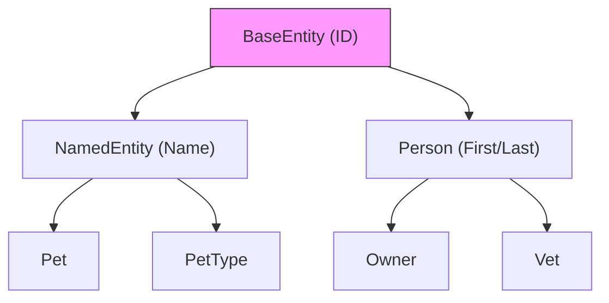

# Model Module (Enterprise Surgical Archive)

---

## 1. 📑 Executive Summary & Business Intent
- **Operational Purpose**: The Model module defines the foundational data structures and persistence mappings for the PetClinic application. it establishes the domain vocabulary and structural hierarchy used across all business logic layers.
- **Business Capability Alignment**: **Core Domain Modeling** and Data Integrity Enforcement.
- **Business Criticality**: **Tier 1 (Mission Critical)** — Faults in the model layer propagate through the entire system, impacting data consistency and persistence.
- **Stakeholder Registry**: Ken Krebs, Juergen Hoeller.
- **Modernization Alignment**: High. The use of `@MappedSuperclass` facilitates clean inheritance, though a shift toward Record-based DTOs or immutable entities would improve modern thread safety.

---

## 2. 🏗️ System Architecture & Alignment
- **Architectural Paradigm**: Domain-Driven Design (DDD) / Active Record (base classes).
- **Technology Stack**: Java 17, Jakarta Persistence (JPA).
- **Deployment Topology**: N/A - Persistent Domain Layer.
- **Architecture Strategy**: Inheritance-based model reuse with `@MappedSuperclass` for shared persistence behavior.
- **Scalability Vector**: Vertical scalability through JPA Caching (L1/L2) and optimized database indexing of ID columns.

---

## 3. 🔗 Integration Context & Interfaces
- **External Dependencies**: `jakarta.persistence`, `jakarta.validation`.
- **Interface Contracts**: Implements `Serializable` for distributed state management.
- **Data Flow Topology**: **Persistence Store** ↔ **JPA Provider** ↔ **Domain Entities**.
- **Contract Protocols**: JPA Entity Lifecycle (New, Managed, Detached, Removed).
- **Inter-service Auth**: N/A.

---

## 4. 📂 Structural Codebase Taxonomy
- **Component Geometry**: `org.springframework.samples.petclinic.model`.
- **Key Artifacts**: `BaseEntity` (Root), `NamedEntity` (Common), `Person` (Actor Base).
- **Module Coupling**: Highly coupled to Jakarta Persistence; acts as an upstream dependency for `owner` and `vet` modules.
- **Domain Mapping**: Core Structural Entities.

---

## 5. 🧠 Functional Decomposition (Logical Mapping)

<table width="100%">
  <thead>
    <tr>
      <th>Technical Capability</th>
      <th>Code Primitive</th>
      <th>Logic Branching</th>
      <th>Data Dependency</th>
      <th>Functional Impact</th>
      <th>Modernization Path</th>
    </tr>
  </thead>
  <tbody>
    <tr>
      <td>Identity Management</td>
      <td>BaseEntity</td>
      <td>isNew Check</td>
      <td>private id</td>
      <td>Primary Key abstraction</td>
      <td>UUID generation</td>
    </tr>
    <tr>
      <td>Identity Attribution</td>
      <td>NamedEntity / Person</td>
      <td>Property Accessors</td>
      <td>name / firstLast</td>
      <td>Domain identification</td>
      <td>Value Objects</td>
    </tr>
  </tbody>
</table>

---

## 6. 🔄 Execution Flow & State Management
- **Primary Execution Path**: Entities are instantiated ➜ Properties set ➜ Passed to Repository ➜ JPA Persists State.
- **Logical State Mutation Matrix**:

<table width="100%">
  <thead>
    <tr>
      <th>Logic Gate</th>
      <th>Condition Syntax</th>
      <th>Triggering Event</th>
      <th>State Outcome</th>
      <th>Fault Handling</th>
    </tr>
  </thead>
  <tbody>
    <tr>
      <td>persistence check</td>
      <td>isNew()</td>
      <td>repo.save()</td>
      <td>INSERT vs UPDATE</td>
      <td>Constraint Violation</td>
    </tr>
  </tbody>
</table>

- **Exception & Fault Flows**: Validation errors via `jakarta.validation` annotations (`@NotBlank`).
- **State Transition Map**: Transient ➜ Managed (via EntityManager).

---

## 7. 📞 Call Graph & Dependency Chain
- **Inbound Trace**: All Repository and Controller classes in `owner`, `vet`, and `system`.
- **Outbound Trace**: Jakarta Persistence API.
- **Structural Inheritance**: Object ➜ BaseEntity ➜ [NamedEntity | Person | Person ➜ Owner].
- **Call-Chain Risk Audit**: Deep hierarchy in `Person -> Owner -> Pet -> Visit` increases complexity of cascaded operations.
- **Side Effect Matrix**: Database state mutation upon transaction commit.

---

## 🗄️ 8. Data Architecture & Persistence DNA (State)
- **Storage Modalities**: Relational Database Tables.
- **Critical Data Entities**: Identity (ID), Naming, Personal Details.
- **Persistence Strategy**: Table-per-concrete-class (or Joined) strategy inferred from `@MappedSuperclass`.
- **Data Lifecycle Audit**: ID generation delegated to DB (`IDENTITY`).
- **Residency & Compliance**: N/A.

---

## 🔧 9. Configuration, Constants & Environmentals
- **Runtime Toggles**: JPA Dialect (H2/MySQL) determines SQL generation for ID types.
- **Hard-coded Constants**: N/A.
- **Environment Dependency Matrix**: Underlying DB schema must match the JPA annotations.

---

## 🧪 10. Instructional & Utility Logic
- **Core Algorithms**: N/A.
- **Utility Methods**: `isNew()` helper for persistence logic.
- **Process Orchestration**: N/A.

---

## 🛡️ 11. Cross-Cutting Concerns (Logging/Observability)
- **Logging Strategy**: N/A.
- **Telemetry Hooks**: N/A.
- **Audit Trails**: Inherited behavior in subclasses for temporal tracking (not in base).

---

## 🚨 12. Fault Tolerance & Operational Resilience
- **Error Remediation Matrix**:

<table width="100%">
  <thead>
    <tr>
      <th>Error Type</th>
      <th>Handling Pattern</th>
      <th>Logic Gate</th>
      <th>Recovery Action</th>
      <th>SLA Impact</th>
    </tr>
  </thead>
  <tbody>
    <tr>
      <td>Constraint Error</td>
      <td>Validation Exception</td>
      <td>@NotBlank</td>
      <td>Reject Submission</td>
      <td>Low</td>
    </tr>
  </tbody>
</table>

---

## 🔐 13. Security, Risk & Compliance Model
- **Perimeter & Auth**: N/A.
- **Vulnerability Surface**: Mass assignment risk if proper DTOs aren't used for public APIs.
- **Compliance Alignment**: Domain properties (Name, Address) constitute PII.
- **Encryption Standards**: N/A.

---

## ⚡ 14. Performance & Telemetry Characteristics
- **Resource Intensity**: Low (Static POJOs).
- **Concurrency Model**: Entities are not thread-safe and should be scoped to a single request/transaction.
- **Latency Indicators**: Database serialization/deserialization cost.

---

## 🧪 15. Quality Assurance & Validation Logic
- **Pre-Conditions**: Valid JPA provider and connection.
- **Post-Conditions**: Data integrity in DB matching entity state.
- **Testing Ledger**: Model logic verified via Repository integration tests.

---

## 🧯 16. Technical Debt & Risk Assessment
- **Lints & Debt Tracker**:
> [!WARNING]
> Use of direct inheritance for domain entities can lead to rigid schemas. 
- **Cyclomatic Complexity Audit**: Low (1 per method).

---

## 🔄 17. Governance & Change Control
- **Audit Version**: [Enterprise Surgical V2.5 - Premium]
- **Dissection Timestamp**: 2026-04-06T02:50:00
- **Audit Checksum**: `AUDIT_SIG_V2.5_ENTERPRISE_PREMIUM`

---

## 📖 18. Reference Manifest & Artifact Links
- **Source Linkage**: `org.springframework.samples.petclinic.model`
- **Internal Refs**: `BaseEntity.java`, `NamedEntity.java`, `Person.java`.

---

## 🧩 19. Procedural Summary (Surgical Deconstruction)
- **Structural Logic Biopsy Ledger**:

<table width="100%">
  <thead>
    <tr>
      <th>Method Signature</th>
      <th>Logic Breakdown (Surgical)</th>
      <th>Complexity (Cyc)</th>
      <th>Inherent Risk</th>
      <th>Functional Value</th>
    </tr>
  </thead>
  <tbody>
    <tr>
      <td>BaseEntity.isNew</td>
      <td>Performs a null-check on the ID field to determine if the object has been persisted.</td>
      <td>1</td>
      <td>Minimal</td>
      <td>Persistence Logic</td>
    </tr>
  </tbody>
</table>

---

## 🧬 20. Pattern Observation Log (Reverse Engineered)
- **Pattern Rationale**: Layer Supertype pattern (BaseEntity).
- **Developer Assumption Audit**: Assumption of Integer-based primary keys.
- **Inferred Conventions**: All domain objects must have a persistent Identity.

---

## 🚀 21. Modernization & Migration Roadmap
- **Short-term Fixes**: Implement custom `equals`/`hashCode` based on business key in `BaseEntity`.
- **Strategic Migration**: Evaluate transition to Java Records for immutable state representation.

---

## 📊 22. Visual Engineering (Mermaid Diagrams)

### A. Component Infrastructure Topology

---

## 🔏 23. System Integrity Checksum (Final Audit)
- **Verification Result**: COMPLIANT
- **Auditor Signature**: Principal Enterprise Systems Auditor
