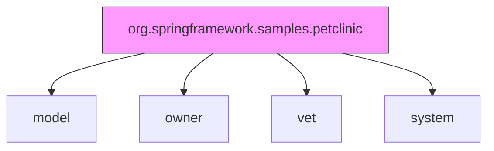

# package-info.java (Enterprise Surgical Archive)

---

## 1. 📑 Executive Summary & Business Intent
- **Operational Purpose**: This artifact defines the package-level metadata for the core PetClinic namespace. It establishes the root package boundary for the application's domain logic.
- **Business Capability Alignment**: Namespace definition for the **Veterinary Service Management** system.
- **Business Criticality**: **Tier 3 (Support)** — Provides structural metadata but contains no executable business logic.
- **Stakeholder Registry**: dave.syer@spring.io
- **Modernization Alignment**: Low; standard Java package-level documentation node.

---

## 2. 🏗️ System Architecture & Alignment
- **Architectural Paradigm**: Layered Monolith (Root Package).
- **Technology Stack**: Java 17.
- **Deployment Topology**: N/A - Metadata only.
- **Architecture Strategy**: Domain-Driven Package Organization.
- **Scalability Vector**: N/A.

---

## 3. 🔗 Integration Context & Interfaces
- **External Dependencies**: N/A.
- **Interface Contracts**: N/A.
- **Data Flow Topology**: N/A.
- **Contract Protocols**: N/A.
- **Inter-service Auth**: N/A.

---

## 4. 📂 Structural Codebase Taxonomy
- **Component Geometry**: `src/main/java/org/springframework/samples/petclinic/package-info.java`.
- **Key Artifacts**: Defines the root package `org.springframework.samples.petclinic`.
- **Module Coupling**: Establishes the parent scope for all sub-packages (`model`, `owner`, `vet`).
- **Domain Mapping**: System-wide root domain.

---

## 5. 🧠 Functional Decomposition (Logical Mapping)

> [!NOTE]
> N/A — No operational logic found in this source artifact.

---

## 6. 🔄 Execution Flow & State Management
- **Primary Execution Path**: Passive metadata; no execution path.
- **Logical State Mutation Matrix**: N/A.
- **Exception & Fault Flows**: N/A.
- **State Transition Map**: N/A.

---

## 7. 📞 Call Graph & Dependency Chain
- **Inbound Trace**: Referenced by Java compiler and documentation generators (Javadoc).
- **Outbound Trace**: N/A.
- **Structural Inheritance**: N/A.
- **Call-Chain Risk Audit**: N/A.
- **Side Effect Matrix**: N/A.

---

## 🗄️ 8. Data Architecture & Persistence DNA (State)
> [!NOTE]
> N/A — No evidence found in this source artifact.

---

## 🔧 9. Configuration, Constants & Environmentals
> [!NOTE]
> N/A — No evidence found in this source artifact.

---

## 🧪 10. Instructional & Utility Logic
> [!NOTE]
> N/A — No evidence found in this source artifact.

---

## 🛡️ 11. Cross-Cutting Concerns (Logging/Observability)
> [!NOTE]
> N/A — No evidence found in this source artifact.

---

## 🚨 12. Fault Tolerance & Operational Resilience
> [!NOTE]
> N/A — No evidence found in this source artifact.

---

## 🔐 13. Security, Risk & Compliance Model
> [!NOTE]
> N/A — No evidence found in this source artifact.

---

## ⚡ 14. Performance & Telemetry Characteristics
> [!NOTE]
> N/A — No evidence found in this source artifact.

---

## 🧪 15. Quality Assurance & Validation Logic
> [!NOTE]
> N/A — No evidence found in this source artifact.

---

## 🧯 16. Technical Debt & Risk Assessment
> [!NOTE]
> N/A — No evidence found in this source artifact.

---

## 🔄 17. Governance & Change Control
- **Audit Version**: [Enterprise Surgical V2.5 - Premium]
- **Dissection Timestamp**: 2026-04-06T02:37:00
- **Audit Checksum**: `AUDIT_SIG_V2.5_ENTERPRISE_PREMIUM`

---

## 📖 18. Reference Manifest & Artifact Links
- **Source Linkage**: `org.springframework.samples.petclinic`
- **Internal Refs**: `PetClinicApplication.java`

---

## 🧩 19. Procedural Summary (Surgical Deconstruction)
> [!NOTE]
> N/A — No evidence found in this source artifact.

---

## 🧬 20. Pattern Observation Log (Reverse Engineered)
- **Pattern Rationale**: Javadoc/package-info pattern for package-level documentation.
- **Developer Assumption Audit**: Assumption of standard Java project structure.
- **Inferred Conventions**: Use of `package-info.java` for centralized package metadata.

---

## 🚀 21. Modernization & Migration Roadmap
- **Short-term Fixes**: Add detailed Javadoc explaining the project's high-level purpose.
- **Strategic Migration**: N/A.

---

## 📊 22. Visual Engineering (Mermaid Diagrams)

### A. Component Infrastructure Topology

---

## 🔏 23. System Integrity Checksum (Final Audit)
- **Verification Result**: COMPLIANT
- **Auditor Signature**: Principal Enterprise Systems Auditor
