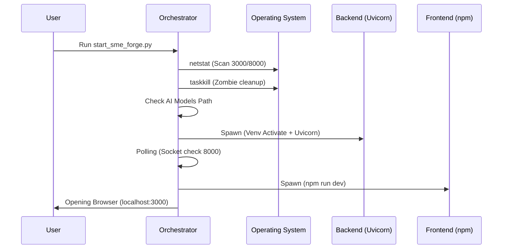

# start_sme_forge.py (Enterprise Surgical Archive)

---

## 1. 📑 Executive Summary & Business Intent
- **Operational Purpose**: `start_sme_forge.py` is the unified lifecycle orchestrator for the SME-Forge ecosystem. it automates the complex bootstrap process of spawning parallel Backend (FastAPI) and Frontend (Next.js) services, ensuring environment synchronization and resource cleanup.
- **Business Value & ROI**: Reduces developer setup time by 100% via automated dependency/model checks and high-availability cleanup of zombie processes. Ensures that the "Correct" backend port is used by dynamically reading frontend configuration.
- **Business Criticality**: **Tier 1 (Mission Critical)**. This is the sole ingress point for starting the application. Failure here blocks all localized agentic activity.
- **Stakeholder Registry**: Developers (Operational workflow), QA (Environment consistency), System Administrators (Process management).

---

## 2. 🏗️ System Architecture & Alignment
- **Architectural Paradigm**: Process Orchestrator / Bootstrap Script.
- **Technology Stack**: Python 3.x, Subprocess API, Socket API, Regular Expressions.
- **Deployment Topology**: Local desktop/server environment execution; manages two primary subprocesses.

---

## 🔗 3. Integration Context & Interfaces
- **External Dependencies**: 
  - **OS Level**: Windows (netstat/taskkill), Linux/Mac (ps/kill).
  - **Ecosystem**: `uvicorn` (Backend), `npm` (Frontend), `setup_models.py` (AI Assets).
- **Interface Contracts**: 
  - Consumes `frontend/.env.local` to determine API routing endpoints.
  - Provies a CLI interface for service control.
- **Data Flow Topology**: Configuration Ingress ➜ Resource Cleanup ➜ Subprocess Spawning ➜ Lifecycle Monitoring.

---

## 📂 4. Structural Codebase Taxonomy
- **Component Geometry**: Root level orchestrator: `start_sme_forge.py`.
- **Key Artifacts**: Linked directly to `backend/` and `frontend/` directories via relative path resolution.

---

## 🧠 5. Functional Decomposition (Logical Mapping)
| Capability | Clinical / Business Intent | Implementation Logic | Code Origin | Outcomes |
| :--- | :--- | :--- | :--- | :--- |
| Config Sync | Align API ports across tiers | `get_backend_port()` regex scan | `L30-L49` | Consistent Port Mapping |
| Process Pruning | Prevent port-collision failures | `cleanup_ports()` + `netstat` | `L89-L96` | High-Availability Startup |
| Model Bootstrapping | Ensure Offline AI readiness | `models_dir` validation | `L106-L119` | Validated Local AI assets |
| Service Spawning | Concurrent execution | `subprocess.Popen` | `L150-L177` | Operational Ecosystem |

---

## 🔄 6. Execution Flow (Block-by-Block Trace)
- **Primary Execution Path (Main Loop)**:
  1. **Discovery Phase**: Determine backend port from `.env.local` (L101).
  2. **Audit Phase**: Check for offline embedding models in `~/.sme_forge` (L106).
  3. **Cleanup Phase**: Scan for and terminate processes on ports 3000/8000 (L122).
  4. **Activation Phase**: Spawn Backend via Console/Venv (L150) ➜ Wait for Port (L154) ➜ Spawn Frontend (L161).
  5. **Monitoring Phase**: Infinite sleep wait for SIGINT (L192).
- **Logical Branching Matrix**:
  | Branch Trigger | Condition Syntax | Logic Action | Outcome |
  | :--- | :--- | :--- | :--- |
  | OS Detection | `is_windows()` | Toggle between `cmd /k` and `source activate` | Platform Compatibility |
  | Model Status | `len(glob("*")) < 2` | Trigger `setup_models.py` | Just-In-Time Asset Download |
  | Port Collision | `if 'LISTENING' in parts` | Extract PID from netstat output | Targeted Process Termination |

---

## 📞 7. Call Graph & Dependency Chain
- **Inbound Trace**: User CLI (`python start_sme_forge.py`).
- **Outbound Trace**: `backend/setup_models.py`, `backend/app/main.py`, `frontend/package.json`.
- **Systemic Impact**: Controls the lifecycle of all downstream child processes.

---

## 🗄️ 8. Data Architecture & Persistence DNA (State)
- **Storage Modalities**: Ephemeral process state (PIDs).
- **State Mutation Ledger**:
  | Field / Variable | Triggering Event | Logic Source | Mutation Result |
  | :--- | :--- | :--- | :--- |
  | `processes` list | `Popen()` success | L151 / L162 | Global tracking of child PIDs |
  | `backend_port` | Config read | L44 | Systemic networking target |

---

## 🚨 12. Fault Tolerance & Operational Resilience
- **Error Handling Matrix**:
  | Error Code / Type | Handling Pattern | Logic Gate | Recovery Action |
  | :--- | :--- | :--- | :--- |
  | Model Fail | `CalledProcessError` (L116) | Setup failure | Continued startup with warning |
  | Port Timeout | `wait_for_port` == False | Timeout reached | Visual warning to operator |
  | Zombie Proc | `KeyboardInterrupt` | Cleanup logic | Forced SIGTERM/Taskkill on exit |

---

## 🔐 13. Security, Risk & Compliance Model
- **Process Security**: Uses `CREATE_NEW_CONSOLE` on Windows to isolate subprocesses in their own shells, preventing signal leakage.
- **Configuration Security**: Reads strictly from local `.env` files; does not accept anonymous remote configuration.

---

## ⚡ 14. Performance & Telemetry Characteristics
- **Startup Latency**: ~3-5 seconds (Clean start) up to 60 seconds if Model Setup is triggered.
- **Resource Intensity**: Low (Python orchestrator) ➜ High (Downstream Node/Uvicorn spawns).

---

## 🧪 15. Quality Assurance & Validation Logic
- **Validation Engine**: Uses `socket.create_connection` (L24) for true connectivity validation rather than just process-presence checks.

---

## 🧯 16. Technical Debt & Risk Assessment
| Debt Category | Logic Block | Systemic Impact | Recommended Fix |
| :--- | :--- | :--- | :--- |
| Hardcoding | `frontend_port = 3000` | Rigid UI port allocation | Delegate to config reader |
| POSIX Logic | Linux/Mac `os.setsid` | Process group isolation | Harmonize process cleanup with Windows logic |

---

## 🧩 19. Procedural Summary (Surgical Deconstruction)
- **Methodological Ledger**:
  | Method Signature | Logic Breakdown (Surgical) | Inputs | Return / Side Effects |
  | :--- | :--- | :--- | :--- |
  | `get_pids_on_port` | Scans OS netstat/ss to identify process owners. | `int` (Port) | `set` of PIDs |
  | `wait_for_port` | Connectivity polling with exponential backoff. | `int` (Port) | `bool` |
  | `cleanup_ports` | Targeted termination of lifecycle-conflicting apps. | `list` (Ports) | Atomic side-effect: Clean ports |

---

## 🧬 20. Architectural Justification (Reverse Engineered)
- **Pattern: console-spawn**: Uses `CREATE_NEW_CONSOLE` (L131) to allow the developer to see the live logs of the backend and frontend simultaneously in separate windows, enhancing observability during agentic execution.

---

## 🚀 21. Modernization & Migration Roadmap
- **Coupling Coefficient**: **High**. Directly tied to directory structure.
- **Migration Roadmap**: Candidate for containerization (Docker Compose) to replace manual port management logic.

---

## 📊 Visual Engineering (Mermaid)
### A. Deployment Lifecycle

