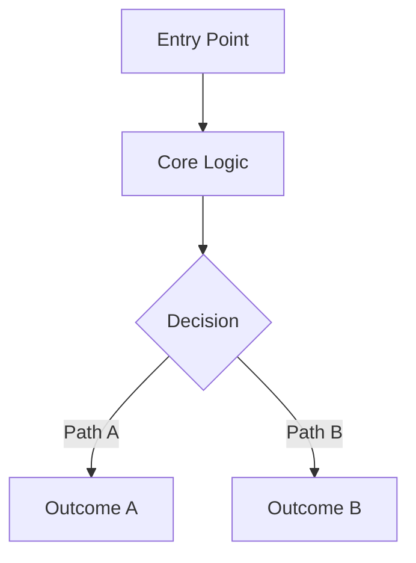
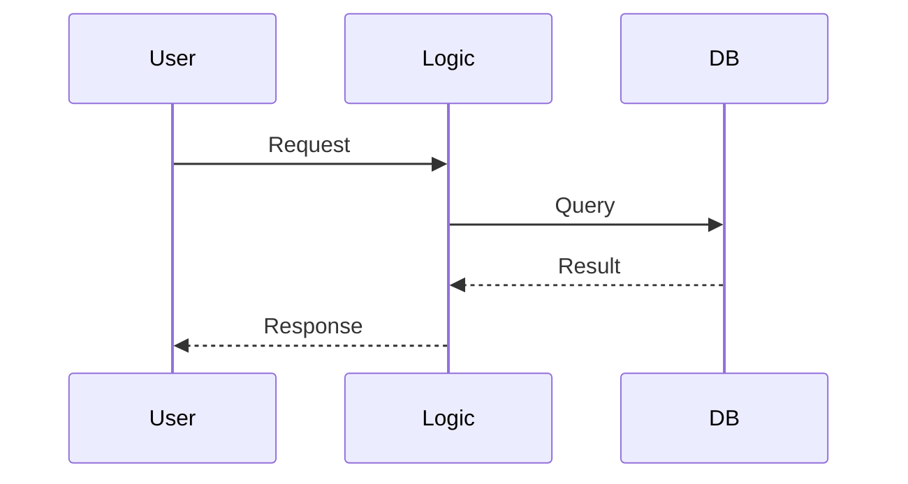

# [PROJECT/MODULE/FILE_NAME] (Enterprise Surgical Archive)

<!-- GUARDRAIL: Do not render these HTML comments in the final output. 
     This is an Enterprise-Grade Surgical Archive. NO SUMMARIZATION OF EXISTING EVIDENCE IS PERMITTED.
     Sections with no supporting evidence in the source code MUST be marked:
     > [!NOTE]
     > N/A — No evidence found in this source artifact.
     Do not fabricate business metrics (ROI, Revenue) if not present in source comments/documentation.
     Persona: Principal Enterprise Systems Auditor. -->

---

## 1. 📑 Executive Summary & Business Intent
- **Operational Purpose**: [Deconstruct the exact technical problem this artifact resolves.]
- **Business Capability Alignment**: [Technical intent of the code (e.g., "Persistence Layer for User Records").]
- **Business Criticality**: [Tier 1 (Mission Critical) / Tier 2 (Operational) / Tier 3 (Support) based on function.]
- **Stakeholder Registry**: [Identifier for technical owners/authors found in code.]
- **Modernization Alignment**: [Potential for refactoring or migration based on technical state.]

---

## 2. 🏗️ System Architecture & Alignment
- **Architectural Paradigm**: [Microservices / Monolith / Event-Driven / Layered Architecture / Serverless.]
- **Technology Stack**: [Version-specific languages, key frameworks, and binary targets.]
- **Deployment Topology**: [Cloud Native, On-Premise, or Hybrid hints found in code.]
- **Architecture Strategy**: [Observed design patterns (e.g., Singleton, Factory).]
- **Scalability Vector**: [Observed concurrency or distributed processing patterns.]

---

## 3. 🔗 Integration Context & Interfaces
- **External Dependencies**: [API endpoints, SaaS connectors, and third-party libraries.]
- **Interface Contracts**: [Internal/External service boundaries.]
- **Data Flow Topology**: [Ingress ➜ Processing ➜ Egress mapping.]
- **Contract Protocols**: [Validation rules and protocol enforcement patterns.]
- **Inter-service Auth**: [Observed auth patterns (JWT, API Keys).]

---

## 4. 📂 Structural Codebase Taxonomy
- **Component Geometry**: [Physical and logical placement within the repository.]
- **Key Artifacts**: [Entry points, service hubs, and primary configuration nodes.]
- **Module Coupling**: [Relationship matrix with other internal components.]
- **Domain Mapping**: [How this code maps to the identified business domain.]

---

## 5. 🧠 Functional Decomposition (Logical Mapping)

<table width="100%">
  <thead>
    <tr>
      <th>Technical Capability</th>
      <th>Code Primitive</th>
      <th>Logic Branching</th>
      <th>Data Dependency</th>
      <th>Functional Impact</th>
      <th>Modernization Path</th>
    </tr>
  </thead>
  <tbody>
    <tr>
      <td>[Feature Name]</td>
      <td>[Method/Class]</td>
      <td>[Core Logic Gate]</td>
      <td>[State/DB Link]</td>
      <td>[System Effect]</td>
      <td>[Refactor/Extract]</td>
    </tr>
  </tbody>
</table>

---

## 6. 🔄 Execution Flow & State Management
- **Primary Execution Path**: [Technical narrative of the "Happy Path" logic.]
- **Logical State Mutation Matrix**:

<table width="100%">
  <thead>
    <tr>
      <th>Logic Gate</th>
      <th>Condition Syntax</th>
      <th>Triggering Event</th>
      <th>State Outcome</th>
      <th>Fault Handling</th>
    </tr>
  </thead>
  <tbody>
    <tr>
      <td>[Gate Name]</td>
      <td>[Code Syntax]</td>
      <td>[Input/Event]</td>
      <td>[New State]</td>
      <td>[Recovery Path]</td>
    </tr>
  </tbody>
</table>

- **Exception & Fault Flows**: [Observed error handling and catch blocks.]
- **State Transition Map**: [Progression of state during execution.]

---

## 7. 📞 Call Graph & Dependency Chain
- **Inbound Trace**: [Internal/external callers identified.]
- **Outbound Trace**: [Invocations made by this artifact.]
- **Structural Inheritance**: [Hierarchy map including Base classes and Interfaces.]
- **Call-Chain Risk Audit**: [Circular or excessively nested dependencies.]
- **Side Effect Matrix**: [Inferred non-returning state changes.]

---

## 🗄️ 8. Data Architecture & Persistence DNA (State)
- **Storage Modalities**: [Databases, caches, memory, and local state.]
- **Critical Data Entities**: [Key Tables, Documents, or Object representations.]
- **Persistence Strategy**: [Isolation levels, SQL patterns, and ORM details.]
- **Data Lifecycle Audit**: [Creation, update, and deletion logic.]
- **Residency & Compliance**: [Localized storage hints (e.g. region strings).]

---

## 🔧 9. Configuration, Constants & Environmentals
- **Runtime Toggles**: [Flags and environment variable usage.]
- **Hard-coded Constants**: [Audit of constants and their impact.]
- **Environment Dependency Matrix**: [Observed differences in environment handling.]

---

## 🧪 10. Instructional & Utility Logic
- **Core Algorithms**: [Complex logic or mathematical processing.]
- **Utility Methods**: [Supporting logic found in this scope.]
- **Process Orchestration**: [How logic is sequenced.]

---

## 🛡️ 11. Cross-Cutting Concerns (Logging/Observability)
- **Logging Strategy**: [Observed logging levels and categories.]
- **Telemetry Hooks**: [Metrics or tracing integration.]
- **Audit Trails**: [Security or compliance logging.]

---

## 🚨 12. Fault Tolerance & Operational Resilience
- **Error Remediation Matrix**: 

<table width="100%">
  <thead>
    <tr>
      <th>Error Type</th>
      <th>Handling Pattern</th>
      <th>Logic Gate</th>
      <th>Recovery Action</th>
      <th>SLA Impact</th>
    </tr>
  </thead>
  <tbody>
    <tr>
      <td>[Error Code]</td>
      <td>[Fail-fast/Retry]</td>
      <td>[Catch Block]</td>
      <td>[Rollback/Log]</td>
      <td>[Inferred]</td>
    </tr>
  </tbody>
</table>

- **Retry & Circuit Breaking**: [Existence of standard resilience patterns.]
- **Self-Healing Capabilities**: [Automatic recovery or state correction logic.]

---

## 🔐 13. Security, Risk & Compliance Model
- **Perimeter & Auth**: [Observed auth implementations.]
- **Vulnerability Surface**: [Input sanitization and RBAC patterns.]
- **Compliance Alignment**: [Hints of PII, GDPR, or HIPAA handling.]
- **Encryption Standards**: [Data hashing or encryption observed.]

---

## ⚡ 14. Performance & Telemetry Characteristics
- **Resource Intensity**: [Observed I/O, loops, or complex ops.]
- **Concurrency Model**: [Thread-safety and locking mechanisms.]
- **Latency Indicators**: [Execution time hints found in code.]

---

## 🧪 15. Quality Assurance & Validation Logic
- **Pre-Conditions**: [Mandatory state requirements.]
- **Post-Conditions**: [Expected output verification.]
- **Testing Ledger**: [Unit, Integration, and E2E hints found.]

---

## 🧯 16. Technical Debt & Risk Assessment
- **Lints & Debt Tracker**:

<table width="100%">
  <thead>
    <tr>
      <th>Debt Category</th>
      <th>Logic Block</th>
      <th>Systemic Impact</th>
      <th>Recommended Fix</th>
      <th>Prioritization</th>
    </tr>
  </thead>
  <tbody>
    <tr>
      <td>[Debt Type]</td>
      <td>[Node/File]</td>
      <td>[Complexity/Coupling]</td>
      <td>[Refactor Plan]</td>
      <td>[High/Low]</td>
    </tr>
  </tbody>
</table>

- **Cyclomatic Complexity Audit**: [God-Methods and high-risk nodes.]

---

## 🔄 17. Governance & Change Control
- **Audit Version**: [Enterprise Surgical V2.5 - Premium]
- **Dissection Timestamp**: [Full Date/Time]
- **Audit Checksum**: `AUDIT_SIG_V2.5_ENTERPRISE_PREMIUM`

---

## 📖 18. Reference Manifest & Artifact Links
- **Source Linkage**: [Paths to primary source files.]
- **Internal Refs**: [Links to related modules.]

---

## 🧩 19. Procedural Summary (Surgical Deconstruction)
- **Structural Logic Biopsy Ledger**:

<table width="100%">
  <thead>
    <tr>
      <th>Method Signature</th>
      <th>Logic Breakdown (Surgical)</th>
      <th>Complexity (Cyc)</th>
      <th>Inherent Risk</th>
      <th>Functional Value</th>
    </tr>
  </thead>
  <tbody>
    <tr>
      <td>[Signature]</td>
      <td>[Forensic Deconstruction]</td>
      <td>[Numeric]</td>
      <td>[High/Med/Low]</td>
      <td>[Intent]</td>
    </tr>
  </tbody>
</table>

---

## 🧬 20. Pattern Observation Log (Reverse Engineered)
- **Pattern Rationale**: [Inferred design patterns applied.]
- **Developer Assumption Audit**: [Observed defensive habits.]
- **Inferred Conventions**: [Project-specific naming or logic conventions.]

---

## 🚀 21. Modernization & Migration Roadmap
- **Short-term Fixes**: [Immediate refactoring needs.]
- **Strategic Migration**: [Long-term architectural moves.]

---

## 📊 22. Visual Engineering (Mermaid Diagrams)

### A. Component Infrastructure Topology

### B. Functional Execution Call Trace

---

## 🔏 23. System Integrity Checksum (Final Audit)
- **Verification Result**: [COMPLIANT / MANUAL_REVIEW_REQUIRED]
- **Auditor Signature**: Principal Enterprise Systems Auditor
